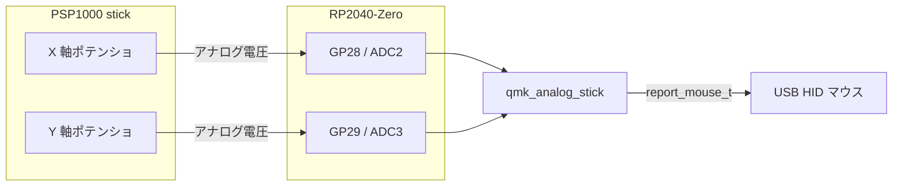
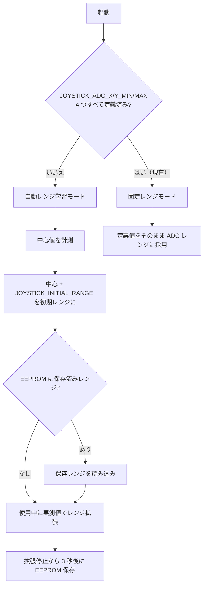

# PSP1000 アナログスティック対応 仕様書

対象: `keyboards/trek/joystick_test`
作成日: 2026-09-20

## 1. 目的

JH16 を想定していた joystick_test ファームウェアのターゲットを、PSP1000 用アナログスティックに切り替える。
ライブラリ `qmk_analog_stick.c` / `qmk_analog_stick.h` は無変更のまま使用し、変更は keymap 側の設定のみに閉じる。

## 2. ハードウェア

| 項目 | 内容 |
|------|------|
| MCU | RP2040-Zero |
| X 軸 | GP28（ADC2） |
| Y 軸 | GP29（ADC3） |
| 押し込みスイッチ | なし |
| ADC 分解能 | 10 bit（0〜1023、`analogReadPin`） |

## 3. 設定（keymaps/default/config.h）

| マクロ | 値 | 備考 |
|--------|----|------|
| `JOYSTICK_X_PIN` | `GP28` | 必須 |
| `JOYSTICK_Y_PIN` | `GP29` | 必須 |
| `JOYSTICK_SW_PIN` | 未定義 | PSP1000 にはスイッチが無い。未定義でクリック機能が無効になる |
| `JOYSTICK_ADC_X_MIN` / `JOYSTICK_ADC_X_MAX` | `524` / `1023` | 実測値（2026-09-20） |
| `JOYSTICK_ADC_Y_MIN` / `JOYSTICK_ADC_Y_MAX` | `524` / `1023` | 実測値（2026-09-20） |
| `VIA_EEPROM_CUSTOM_CONFIG_SIZE` | `10`（keyboard 側 config.h） | 自動学習レンジの EEPROM 保存用。固定レンジでは未使用だが残しても害はない |

実測レンジは 0〜1023 の下半分を使わない非対称なものだが、ライブラリの `normalize_axis` は起動時に計測した中心値から
各側のレンジ端までを個別に ±1000 へスケーリングするため、そのまま定義してよい。

JH16 向けに残っていた `JOYSTICK_ADC_Y_MAX 784` は削除した。
ライブラリは 4 つのレンジマクロが揃って初めて固定レンジになるため、単独定義は無効（自動学習モードのまま）で、値としても JH16 の実測値であり PSP1000 には無関係だった。

## 4. レンジ決定の流れ

### 経緯

1. 2026-09-20: 実測値未受領のため自動レンジ学習モード（`JOYSTICK_INITIAL_RANGE 100`）で暫定ビルド
2. 2026-09-20: 実測値 X/Y = 524〜1023 を受領し、固定レンジモードへ切り替え。`JOYSTICK_INITIAL_RANGE` は削除
3. 2026-09-20: 上下反転を keymap.c で暫定実装
4. 2026-09-21: ライブラリに `JOYSTICK_INVERT_X/Y` を追加し、config.h の `JOYSTICK_INVERT_Y 1` に置き換え（第 5 章）

### 残作業

* 実機で動作確認後、キーボードディレクトリ直下の配布用 `.uf2` を更新する

## 5. 上下反転（JOYSTICK_INVERT_Y）

取り付け向きの都合で上下を反転する。`keymaps/default/config.h` で `JOYSTICK_INVERT_Y 1` を定義し、ライブラリ側で反転している。

* `JOYSTICK_INVERT_X` / `JOYSTICK_INVERT_Y` は 2026-09-21 に `qmk_analog_stick` ライブラリへ追加した（仕様: ライブラリ側 `docs/invert_axis.md`）
* 追加前は keymap.c の `pointing_device_task_user` で戻り値の `y` を符号反転していたが、ライブラリ対応に伴い撤去した
* 左右も反転したくなった場合は `JOYSTICK_INVERT_X 1` を追加する
* `analog_stick_get_scroll_values` は本キーマップでは未使用のため、スクロール側の反転設定は変更していない

## 6. 変更しないもの

* `qmk_analog_stick.c` / `qmk_analog_stick.h` は当初無変更の方針だったが、2026-09-21 に軸反転マクロを追加（それ以外は無変更）
* `halconf.h`（`HAL_USE_ADC TRUE`）、`mcuconf.h`（`RP_ADC_USE_ADC1 TRUE`）: GP28/GP29 でそのまま有効
* `keyboard.json` のマトリクス・エンコーダ・RGB 設定

## 7. 検証

* ビルド: `make trek/joystick_test:default` が通ること
* 実機: コンソール（`JOYSTICK_DEBUG 1`）で `AnalogStick center` / `AnalogStick range` の出力を確認し、実測 min/max の取得に使う
