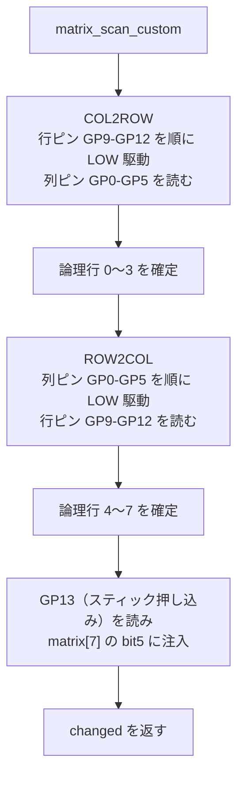
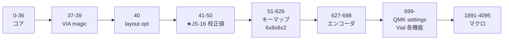

# TReK Lettio ビルドエラー修正記録

作成日: 2026-07-30

## 1. 概要

`make trek/lettio:default` がビルドエラーで失敗していた問題の調査と修正の記録。

Lettio は TReK Rouge（アナログスティック搭載マクロパッド）と TReK Lagoon（デュプレックス
マトリクスのキーボード）から設定ファイルを流用して作られており、**流用元の前提条件が
Lettio の実機構成と合っていない**ことが原因だった。

## 2. ハードウェア構成（確定した仕様）

| 項目 | 値 |
|---|---|
| MCU | RP2040 |
| ブートローダ | rp2040 |
| 行ピン | GP9, GP10, GP11, GP12（4本） |
| 列ピン | GP0 〜 GP5（6本） |
| マトリクス | デュプレックス方式：論理 8行 × 6列 = 48スロット |
| 実キー数 | 47 |
| ロータリーエンコーダ | 3基（GP14/GP15, GP26/GP27, GP7/GP8） |
| アナログスティック | JS-16（X:GP28, Y:GP29, SW:GP13） |
| WS2812 | GP6 |

### 2.1 デュプレックスマトリクスの走査

行ピン4本・列ピン6本で論理8行を得るため、ダイオード方向を反転した2系統を交互に走査する。



### 2.2 アナログスティック押し込みスイッチの扱い

TReK Rouge と同じ方式を踏襲する。

- `qmk_analog_stick.c` が持つ `JOYSTICK_SW_PIN` 経由のマウスボタン直結機能は**使わない**
  （`config.h` で `JOYSTICK_SW_PIN` を定義しないことで無効化される）
- 代わりに `matrix.c` が GP13 の状態を**キーマトリクスの空きスロットへ注入**する
- これにより Vial からスティック押し込みに任意のキーを再割り当てできる
- Rouge では同スロットを `BOOTMAGIC_ROW` / `BOOTMAGIC_COLUMN` に指定して
  「スティックを押し込みながら USB 接続 → ブートローダー起動」としている
  （Lettio では GP13 の結線が未確認のため採用しない。9 章参照）

| | TReK Rouge | TReK Lettio |
|---|---|---|
| マトリクス | 4行 × 5列（20スロット） | 8行 × 6列（48スロット） |
| 実キー数 | 19 | 47 |
| 空きスロット | `[3,2]` | `[7,5]` |
| スティック押し込みの割当先 | `[3,2]` | `[7,5]` |

Rouge の `matrix.c` をそのままコピーしたため注入先が `[3,2]` のままになっていたが、
Lettio では `[3,2]` は実キー（`LGUI_T(KC_LNG2)`）が存在するため、`[7,5]` へ変更した。

## 3. 検出した不具合と修正内容

### 3.1 ビルドを停止させていたエラー

#### ① `keyboard.json` の processor が AVR のままだった

```diff
- "processor": "atmega32u4",
- "bootloader": "atmel-dfu",
+ "processor": "RP2040",
+ "bootloader": "rp2040",
```

GP0〜GP29 は RP2040 のピン名のため、AVR ツールチェーンでは
`error: 'GP5' undeclared here (not in a function)` となっていた。

#### ② `config.h` の `MATRIX_ROWS` が 4 だった

```diff
- #define MATRIX_ROWS 4
+ #define MATRIX_ROWS 8
```

`keymaps/default/config.h` の `LAYOUT` マクロは 8行×6列を生成しているため、
`error: excess elements in array initializer` が発生していた。

#### ③ `keyboard.json` の `layouts` がバリデーションで弾かれていた

2つの問題が重なっていた。

**(a) 列番号 8 が3箇所**

`[6,8]` `[5,8]` `[4,8]` → `[6,5]` `[5,5]` `[4,5]`。
KLE のラベルで `F`(=5列目) とすべきところを `I`(=8列目) と誤記していた。

**(b) レイアウト名が `LAYOUT` で、keymap 側の手書きマクロと衝突**

```diff
- "layouts": { "LAYOUT": { ... } }
+ "layouts": { "LAYOUT_lettio": { ... } }
```

Lagoon が `LAYOUT_lagoon` としているのと同じ回避策。

バリデーションに失敗すると QMK はレイアウトマクロを生成せず、代わりに
`#error("<keyboard>.h is required unless your keyboard uses data-driven configuration...")`
を出力するため、原因が分かりにくいエラーになっていた。

#### ④ `keymap.c` に廃止済みキーコード

```diff
- KC_LSHIFT
+ KC_LSFT
```

現行 QMK では削除されたエイリアス。6箇所（全レイヤー）。

### 3.2 ビルドは通るが動作しない不具合

#### ⑤ `matrix.c` が論理行 4〜7 を走査していなかった

Rouge（4行のシンプルマトリクス）から `matrix.c` をコピーした際、Lagoon が持つ
ROW2COL 側の走査処理が欠落していた。この状態では**右手側 23キーが一切反応しない**。

追加した関数：

- `select_col()` / `unselect_col()` / `unselect_cols()`
- `read_rows_on_col()` — 列を駆動して行を読み、論理行 4〜7 を確定する

あわせて `unselect_rows()` / `init_pins()` のループ上限を `MATRIX_ROWS` から
`MATRIX_ROWS / 2` に修正した（行ピンは4本しかないため）。

#### ⑥ スティック押し込みが実キーと衝突していた

`[3,2]`（`LGUI_T(KC_LNG2)` が割当済み）を無条件に上書きしていた。
空きスロット `[7,5]` へ変更。

```diff
- // JS-16 SW (GP13) → [3,2]
+ // JS-16 SW (GP13) → [7,5]
```

`config.h` のブートマジック座標も追従。

```diff
- #define BOOTMAGIC_ROW 3
- #define BOOTMAGIC_COLUMN 2
+ #define BOOTMAGIC_ROW 0
+ #define BOOTMAGIC_COLUMN 0
```

`keymaps/default/config.h` の `LAYOUT` マクロに `K75` を追加（47キー → 48キー）。

```diff
-   K30,   K31,  K32,   K33,                     K70,   K71,  K72,   K74  \
+   K30,   K31,  K32,   K33,      K75,            K70,   K71,  K72,   K74  \
...
-   {   K70,   K71,   K72,   K73,   K74, KC_NO }  \
+   {   K70,   K71,   K72,   K73,   K74,   K75 }  \
```

#### ⑦ `vial.json` のマトリクス定義が不整合

```diff
- "matrix": { "rows": 4, "cols": 6 }
+ "matrix": { "rows": 8, "cols": 6 }
```

あわせて `6,8` / `5,8` / `4,8` を `6,5` / `5,5` / `4,5` に修正。
またスティック位置（x=8, y=4.25）にあったレジェンド無しの空きキーを `7,5` に変更した
（`a:7` → `a:4`）。

## 4. 修正ファイル一覧

| ファイル | 内容 |
|---|---|
| `keyboard.json` | processor/bootloader を RP2040 へ、`LAYOUT` → `LAYOUT_lettio`、列8→5、`[7,5]` 追加 |
| `config.h` | `MATRIX_ROWS` 4→8、ブートマジック `[3,2]`→`[7,5]` |
| `matrix.c` | ROW2COL 走査を追加、スティック SW 注入先を `[7,5]` へ |
| `keymaps/default/config.h` | `LAYOUT` マクロに `K75` を追加 |
| `keymaps/default/keymap.c` | `KC_LSHIFT`→`KC_LSFT`、全6レイヤーに `K75` を追加 |
| `keymaps/default/vial.json` | `rows` 4→8、列8→5、空きキー→`7,5` |

## 5. 検証結果

```
Linking: .build/trek_lettio_default.elf                    [OK]
Creating UF2 file for deployment: .build/trek_lettio_default.uf2  [OK]
```

- ファームウェアサイズ: text 52,952 bytes / bss 265,468 bytes
- 生成された `LAYOUT_lettio` は 48キー、8×6 の全スロットが埋まり `XXX`（KC_NO）なし
- `keyboard.json` と `vial.json` のキー座標が48キーで完全一致（順序含む）

## 6. EEPROM 予約領域の検証（2026-07-30 追加調査）

「Vial でキーマップを変更するとエンコーダー設定が壊れる。JS-16 の保存領域が原因ではないか」
という報告を受けての検証。

### 6.1 検証方法

マクロの値を推測せず、実際のビルドフラグでコンパイルして確定させた。
`matrix.c` に一時的に `char probe_xxx[(マクロ式) + 1];` を並べてビルドし、
`arm-none-eabi-nm --print-size` でシンボルサイズを読み出した（検証後にプローブは削除）。

### 6.2 確定した EEPROM マップ

`TOTAL_EEPROM_BYTE_COUNT = 4096`（RP2040 / wear leveling）

| 範囲 | サイズ | 内容 | 算出式 |
|---|---|---|---|
| 0 – 36 | 37 | コア EEPROM | `EECONFIG_SIZE` |
| 37 – 39 | 3 | VIA magic | `VIA_EEPROM_MAGIC_ADDR = EECONFIG_SIZE` |
| 40 | 1 | VIA layout options | `VIA_EEPROM_LAYOUT_OPTIONS_SIZE` |
| **41 – 50** | **10** | **★ジョイスティック校正値** | `VIA_EEPROM_CUSTOM_CONFIG_ADDR`, `VIA_EEPROM_CUSTOM_CONFIG_SIZE` |
| 51 – 626 | 576 | ダイナミックキーマップ | `6層 × 8行 × 6列 × 2` |
| 627 – 698 | 72 | エンコーダ | `3基 × 6層 × 2方向 × 2` |
| 699 – 738 | 40 | QMK settings | `sizeof(qmk_settings_t)` |
| 739 – 1058 | 320 | Vial タップダンス | |
| 1059 – 1378 | 320 | Vial コンボ | |
| 1379 – 1698 | 320 | Vial キーオーバーライド | |
| 1699 – 1890 | 192 | Vial Alt Repeat Key | |
| 1891 – 4095 | 2205 | ダイナミックマクロ | 残り全部 |



### 6.3 結論: JS-16 の予約領域は正しく、重なっていない

- `VIA_EEPROM_CUSTOM_CONFIG_ADDR` = **41**、`VIA_EEPROM_CUSTOM_CONFIG_SIZE` = **10** → 41〜50
- `VIA_EEPROM_CONFIG_END` = **51** = ダイナミックキーマップの開始アドレス
- ジョイスティックの保存内容は magic(2) + x_min/x_max/y_min/y_max(各2) = ちょうど 10 バイト

**予約領域を 1 バイトも超過していない。** よってジョイスティックの保存処理が
エンコーダー領域（627〜698）を壊すことはない。

書き込みが奇数アドレス 41 から始まる点も確認したが、QMK の wear leveling は
`wear_leveling_write_raw()` でアドレス 64 未満を 1 バイト単位のログエントリとして
扱うため、隣接バイトを巻き込む動作はしない。

また Vial 有効時の `nvm_dynamic_keymap_update_buffer()` には

```c
if (offset >= dynamic_keymap_eeprom_size || dynamic_keymap_eeprom_size - offset < size)
    return;
```

という境界チェックがあり、ホストからのバッファ書き込みがエンコーダー領域へ
はみ出すこともない。

### 6.4 エンコーダー設定が壊れた真因

**(a) `vial.json` の行数がファームウェアと食い違っていた（修正済み）**

修正前は `vial.json` が `"rows": 4`、ファームウェアは 8行。
Vial GUI はキーの EEPROM オフセットを `層 × 行 × 列 × 2` で自前計算するため、

- GUI の計算: `層 × 4 × 6 × 2` = 層あたり 48 バイト
- ファームの計算: `層 × 8 × 6 × 2` = 層あたり 96 バイト

となり、レイヤー1以降の書き込みが**全く別の場所に着弾する**。
キーマップを1箇所変えると他のレイヤーやキーが巻き込まれて壊れる、という症状になる。
これが報告された現象の主因と考えられる。

**(b) `MATRIX_ROWS` を 4→8 に修正したことで領域が 288 バイト後ろへ移動した**

エンコーダー領域の開始アドレスは `MATRIX_ROWS` に依存する。

| | 修正前 (`MATRIX_ROWS 4`) | 修正後 (`MATRIX_ROWS 8`) |
|---|---|---|
| キーマップ | 51 – 338 (288) | 51 – 626 (576) |
| エンコーダ | **339** – 410 | **627** – 698 |
| QMK settings | 411 – 450 | 699 – 738 |

旧ファームで書かれた EEPROM をそのまま読むと、エンコーダー設定はキーマップ領域の
途中を読んでしまうため必ず化ける。

**→ 今回のファームを書き込んだ後は、必ず EEPROM のリセットが必要。**

### 6.5 あわせて修正した点

`keymaps/default/config.h` にあった

```c
// = EECONFIG_SIZE(37) + VIA_MAGIC(3) + VIA_LAYOUT_OPTIONS(1) = 41
#define JOYSTICK_CALIB_EEPROM_ADDR 41
```

は **どこからも参照されていない死んだ定義**だった。
`qmk_analog_stick.c` が使うのは `JOYSTICK_EEPROM_ADDR`（= `VIA_EEPROM_CUSTOM_CONFIG_ADDR`
として自動計算）であり、この `41` は同じ値をハードコードした重複にすぎない。

将来 `EECONFIG_SIZE` や `VIA_EEPROM_LAYOUT_OPTIONS_SIZE` が変わったときに
古い値を信じて事故る元になるため削除し、算出方法を示すコメントに置き換えた。

同じ死んだ定義が `keyboards/trek/rouge/keymaps/default/config.h` にもあったため、
そちらも同様に削除した（rouge は 4行5列で領域計算自体は正しく、動作への影響はない）。
削除後 `make trek/rouge:default` のビルド通過を確認済み。

なお、予約不足に対する保険は `qmk_analog_stick.c` 側に既に入っている。

```c
STATIC_ASSERT(VIA_EEPROM_CUSTOM_CONFIG_SIZE >= 10,
              "Define VIA_EEPROM_CUSTOM_CONFIG_SIZE >= 10 in config.h ...");
```

### 6.6 EEPROM リセットの手順

いずれかの方法で実施する。

1. Vial の `Security` / `Reset EEPROM`（または VIA の EEPROM リセット）
2. ブートマジック: **Esc キーを押しながら USB を接続**
   （`BOOTMAGIC_ROW 0` / `BOOTMAGIC_COLUMN 0`）→ ブートローダーに入り EEPROM がクリアされる
3. `flash_nuke.uf2` を書き込んでフラッシュを完全消去してから改めてファームを書き込む

リセット後、ジョイスティックの校正値もクリアされるため、自動レンジ学習が
初期状態からやり直しになる（スティックを数回フルストロークさせれば再学習される）。

## 7. キーマップが `0xFE03` に戻る現象の特定（2026-07-30 追加調査）

「Vial でキーマップを変更して切断・再接続すると `0xfe03` に戻る。Rouge でも同じ現象があり、
そのときはアナログスティックの設定値が上書きしていた」という報告を受けての調査。

### 7.1 `0xFE03` の正体

`0xFE03` は QMK のキーコードとして定義されていない値（Unicode キーコード域 0x8000〜0xFFFF に
入るため Vial は生の16進で表示する）。その由来を検算した。

| スティックの学習値 | 16進 | EEPROM 上のバイト列（LE 書き込み） | キーコードとして読んだ値（BE 読み出し） |
|---|---|---|---|
| 1021 | 0x03FD | `FD 03` | **0xFD03** |
| **1022** | **0x03FE** | **`FE 03`** | **0xFE03** |
| 1023 | 0x03FF | `FF 03` | 0xFF03 |

エンディアンの不一致が原因である。

- `save_range()` は `eeprom_update_word()` で `runtime_x_max` 等を **リトルエンディアン**で書く
- ダイナミックキーマップは **ビッグエンディアン**で読む
  ```c
  uint16_t keycode = eeprom_read_byte(address) << 8;
  keycode |= eeprom_read_byte(address + 1);
  ```

**10bit ADC の最大値 ≈1022 が `FE 03` として格納され、キーコードとしては `0xFE03` に見える。**
つまり `0xFE03` は「スティックの学習済み ADC 最大値がキーマップ領域に載っている」ことの
決定的な証拠であり、報告された見立ては正しい。

### 7.2 衝突が起きる条件

`VIA_EEPROM_CUSTOM_CONFIG_SIZE` が未定義だと `via.h` の

```c
#ifndef VIA_EEPROM_CUSTOM_CONFIG_SIZE
#    define VIA_EEPROM_CUSTOM_CONFIG_SIZE 0
#endif
```

が効き、`VIA_EEPROM_CONFIG_END = 41` になる。ダイナミックキーマップの開始アドレスは
`VIA_EEPROM_CONFIG_END` なので、**キーマップが 41 から始まりスティックの保存領域と完全に重なる**。

この状態でのレイヤー0・行0の内容（キーマップ開始 41 の場合）:

| EEPROM | スティックが書く値 | キーマップ上の位置 | Vial での見え方 |
|---|---|---|---|
| 41–42 | magic `0xAD01` | layer0 / row0 / col0 | `0x01AD` |
| 43–44 | `runtime_x_min`（≈0） | layer0 / row0 / col1 | 空 (KC_NO) |
| 45–46 | `runtime_x_max`（≈1022） | layer0 / row0 / col2 | **`0xFE03`** |
| 47–48 | `runtime_y_min`（≈0） | layer0 / row0 / col3 | 空 (KC_NO) |
| 49–50 | `runtime_y_max`（≈1022） | layer0 / row0 / col4 | **`0xFE03`** |

Lettio の `LAYOUT` では行0が `K00..K05` = `QK_GESC, KC_Q, KC_W, KC_E, KC_R, KC_T` なので、
**Esc が `0x01AD`、Q と E が空、W と R が `0xFE03`** という並びになる。

さらに Vial で編集しても、スティックを動かして 3 秒後に `save_range()` が走り同じ場所を
上書きするため、切断・再接続すると `0xFE03` に戻る。報告された症状と完全に一致する。

### 7.3 現在のソースでは衝突していない（機械語レベルで検証）

コンパイル済みオブジェクトを逆アセンブルして実アドレスを確認した。

`qmk_analog_stick.o`（スティックの保存先）:

```asm
62:  2029   movs  r0, #41  @ 0x29   → eeprom_update_word (magic)
6e:  202b   movs  r0, #43  @ 0x2b   → eeprom_update_word (x_min)
76:  202d   movs  r0, #45  @ 0x2d   → eeprom_update_word (x_max)
7e:  202f   movs  r0, #47  @ 0x2f   → eeprom_update_word (y_min)
88:  2031   movs  r0, #49  @ 0x31   → eeprom_update_word (y_max)
```

`nvm_dynamic_keymap.o`（キーマップの開始アドレス）:

```asm
12:  2360   movs  r3, #96  @ 0x60   ← 1レイヤー = 8行 x 6列 x 2 = 96 バイト
22:  3033   adds  r0, #51  @ 0x33   ← DYNAMIC_KEYMAP_EEPROM_ADDR = 51
```

**スティック 41–50 / キーマップ 51 以降 → 重なっていない。**
`keyboards/trek/lettio/config.h` の `VIA_EEPROM_CUSTOM_CONFIG_SIZE 10` が
コア側のコンパイル単位でも正しく効いていることが確認できた。

Rouge も同様に確認済み（`adds r0, #51`、1レイヤー = 4行 x 5列 x 2 = 40 バイト）。

スティックを使うボードすべてに予約定義があることも確認した。

| ボード | `VIA_EEPROM_CUSTOM_CONFIG_SIZE` |
|---|---|
| lettio | `config.h:52` = 10 |
| rouge | `config.h:30` = 10 |
| joystick_test | `config.h:25` = 10 |

### 7.4 結論と対処

現在のソースから作ったファームウェアでは衝突しないため、**Lettio に書き込まれている
ファームウェアが予約定義の入る前の古いビルドである**と考えられる。

`BUILD_ID` は `util/build_id.py` が `random.randrange()` で**ビルドごとにランダム生成**する。

```python
print("#define BUILD_ID ((uint32_t)0x{:08X})".format(random.randrange(0, 2 ** 24 - 1)))
```

このため新しくビルドしたファームを書き込めば `via_eeprom_is_valid()` が必ず false になり、
`eeconfig_init_via()` → `dynamic_keymap_reset()` でキーマップはフラッシュのデフォルトへ
リセットされる。以後 41–50 は予約領域として保護されるので再発しない。

**対処手順**

1. 現在のソースで `make trek/lettio:default` を実行して**ファームを作り直す**
2. Lettio に書き込む
3. 念のため EEPROM をリセットする（6.6 節の手順）
4. Vial でキーマップを変更し、切断・再接続して保持されることを確認する
5. スティックを数回フルストロークさせてから再度切断・再接続し、キーマップが壊れないことを確認する
   （手順 5 が本件の再現確認になる。スティックの保存が走るのは学習レンジが広がって 3 秒後）

### 7.5 再発防止

予約不足に対するコンパイル時ガードは `qmk_analog_stick.c` に既に入っており、
これが今回の衝突条件をそのまま検出する。

```c
STATIC_ASSERT(VIA_EEPROM_CUSTOM_CONFIG_SIZE >= 10,
              "Define VIA_EEPROM_CUSTOM_CONFIG_SIZE >= 10 in config.h to reserve EEPROM space for the joystick range");
```

`VIA_EEPROM_CUSTOM_CONFIG_SIZE` を消す/減らすとビルドが通らなくなるため、
7.2 の衝突状態のファームを新規に作ってしまうことはない。

## 8. ブートマジックを Esc に変更（2026-07-30）

### 8.1 変更内容

```diff
- // ジョイスティック押し込み（GP13 → matrix[7][5]）を押しながら起動でブートローダーへ
- #define BOOTMAGIC_ROW 7
- #define BOOTMAGIC_COLUMN 5
+ // Esc（matrix[0][0] = K00）を押しながら USB 接続でブートローダーへ（QMK 標準の配置）
+ #define BOOTMAGIC_ROW 0
+ #define BOOTMAGIC_COLUMN 0
```

### 8.2 理由

`matrix.c` の `JS_SW_PIN GP13` は Rouge の `matrix.c` をそのまま流用したもので、
**Lettio の実機で JS-16 のプッシュスイッチが GP13 に繋がっているかは未確認**である。

ブートマジックをスティック押し込み `[7,5]` に割り当てていると、GP13 が起動時に LOW と
読まれた場合に `bootmagic_should_reset()` が毎回成立する。

```c
__attribute__((weak)) bool bootmagic_should_reset(void) {
    return matrix_get_row(BOOTMAGIC_ROW) & (1 << BOOTMAGIC_COLUMN);
}

__attribute__((weak)) void bootmagic_scan(void) {
    matrix_scan();
    wait_ms(BOOTMAGIC_DEBOUNCE);
    matrix_scan();
    if (bootmagic_should_reset()) {
        bootmagic_reset_eeprom();   // eeconfig_disable()
        bootloader_jump();          // ★ ブートローダーへジャンプ
    }
}
```

この場合、ファームウェアを書き込んでも起動直後に EEPROM を消してブートローダーへ戻るため、

- `RPI-RP2` ドライブが消えない（すぐ戻ってくる）
- Vial にキーボードとして現れない
- 設定が毎回消える

という症状になる。結線が確定するまでは QMK 標準どおり Esc に置くほうが安全。

なお GP13 が常時 LOW の場合、ブートループとは別に `[7,5]` が押されっぱなしと判定され、
`KC_BTN3`（マウス中クリック）が連打される症状も出る。これは切り分けの手掛かりになる。

### 8.3 スティック押し込みをブートマジックに使いたい場合

GP13 の結線を実機で確認し、Vial 上で `[7,5]` のキーが「スティックを押した時だけ」
反応することを確かめてから、`config.h` を次に戻せばよい。

```c
#define BOOTMAGIC_ROW 7
#define BOOTMAGIC_COLUMN 5
```

## 9. ロータリーエンコーダーが機能していなかった問題（2026-07-30）

### 9.1 症状

ファームウェアの書き込みに成功し Vial から認識できるようになった後も、
**ロータリーエンコーダーのキーマップだけ**が保存されず、再接続すると `0xFE03` に戻る。
通常キーのキーマップは保持される。

### 9.2 原因: `keyboard.json` の `features` に `"encoder": true` が無かった

ビルド済み ELF のシンボルを調べたところ、**encoder 関連のシンボルが 1 つも存在しなかった**。

```
$ arm-none-eabi-nm .build/trek_lettio_default.elf | grep -i encoder
（出力なし）
```

つまりエンコーダーのコードがファームウェアに一切含まれていなかった。

`builddefs/common_features.mk`:

```make
ENCODER_ENABLE ?= no

ifeq ($(strip $(ENCODER_ENABLE)), yes)
    ...
    OPT_DEFS += -DENCODER_ENABLE
```

`ENCODER_ENABLE` の既定値は `no` で、`keyboard.json` の `features` に `"encoder": true`
を書くことで有効化される。**`rules.mk` の `ENCODER_MAP_ENABLE = yes` は
`ENCODER_ENABLE = yes` が前提であり、単独では何も有効にしない**（`ENCODER_MAP_ENABLE` の
処理自体が `ifeq ($(strip $(ENCODER_ENABLE)), yes)` の内側にあるため）。

姉妹機との比較:

| ボード | `features` の `encoder` | 結果 |
|---|---|---|
| lagoon | `true` | 動作 |
| withtk | `true` | 動作 |
| **lettio** | **記載なし** | **コードが入らない** |

`keyboard.json` の `encoder.rotary` にピン定義があるため `ENCODER_A_PINS` /
`ENCODER_B_PINS` は生成されていたが、参照するコードが無いので使われていなかった。

この状態では:

- `NUM_ENCODERS` が `0` に定義される（`nvm_dynamic_keymap.c` の `#else` 側）
- `-DENCODER_MAP_ENABLE` が付かないため `nvm_dynamic_keymap_read_encoder()` /
  `nvm_dynamic_keymap_update_encoder()` および `via.c` のエンコーダーコマンド処理が
  丸ごとコンパイルされない
- `keymap.c` の `encoder_map` も `#if defined(ENCODER_MAP_ENABLE)` で消える

一方 Vial GUI は `vial.json` の記述（`e0` / `e1` / `e2` マーカー）を見てエンコーダーを
表示し編集させるため、**設定はできるがファームウェア側に保存先が存在しない**という
食い違いが生じ、読み戻すと不定値が返っていた。

### 9.3 修正

```diff
  "features": {
      "bootmagic": true,
+     "encoder": true,
      "mousekey": true,
      "extrakey": true,
      "command": true,
      "rgblight": true,
      "rgb_matrix": true
  },
```

### 9.4 検証

修正後、encoder 関連シンボルが出現した。

```
$ arm-none-eabi-nm .build/trek_lettio_default.elf | grep -i encoder
10006522 T dynamic_keymap_get_encoder
1000652a T dynamic_keymap_set_encoder
100051d0 T encoder_init
1000528c T encoder_task
1000bc46 R encoder_map
10006878 T nvm_dynamic_keymap_read_encoder
100068c0 T nvm_dynamic_keymap_update_encoder
...
```

`nvm_dynamic_keymap_read_encoder` の逆アセンブルでアドレスも確認した。

```asm
   c:  2902        cmp   r1, #2        ← encoder_id <= 2（NUM_ENCODERS = 3）
  14:  220c        movs  r2, #12       ← 1レイヤー = 3基 x 2方向 x 2 = 12 バイト
  20:  4b08        ldr   r3, [pc, #32]
  44:  00000273    .word 0x00000273    ← エンコーダ領域 = 627
```

**エンコーダ領域 627–698（72 バイト）が正しく確保された。**
5 章の EEPROM マップどおりの配置になる。

### 9.5 注意

この修正で EEPROM のレイアウトが変わる（エンコーダ 72 バイトが挿入され、
QMK settings 以降が 72 バイト後ろへ移動する）。書き込み後は EEPROM のリセットが必要。
`BUILD_ID` はビルドごとにランダムなので自動的にリセットされるが、
念のため 6.6 節の手順を実施するのが確実。

## 10. RGB Matrix の有効化（2026-07-31）

`keymaps/default/keymap.c` に `g_led_config` が追記されたため、RGB Matrix を有効化した。

### 10.1 追記された `g_led_config` の検証

| 項目 | 内容 | 判定 |
|---|---|---|
| マトリクス対応表 | 8 行 × 6 列 = 48 エントリ | `MATRIX_ROWS` / `MATRIX_COLS` と一致 |
| LED 座標 | 44 点 | `led_count` と一致 |
| LED フラグ | 44 個（すべて `4` = `LED_FLAG_KEYLIGHT`） | 一致 |

### 10.2 修正内容

**(a) `keymaps/default/rules.mk` — RGB Matrix を有効化**

```diff
  RGBLIGHT_ENABLE = no
- RGB_MATRIX_ENABLE = no
+ RGB_MATRIX_ENABLE = yes
```

**(b) `keyboard.json` — WS2812 のドライバを `vendor` に指定**

```diff
  "ws2812": {
+     "driver": "vendor",
      "pin": "GP6"
  },
```

`WS2812_DRIVER` の既定値は `bitbang` である。

```make
# builddefs/common_features.mk:971
WS2812_DRIVER ?= bitbang
```

RP2040 では bitbang はタイミングが不安定になりやすく、姉妹機はいずれも PIO を使う
`vendor` を指定している。

| ボード | `ws2812` |
|---|---|
| withtk | `{"driver": "vendor", "pin": "GP29"}` |
| grain | `{"driver": "vendor", "pin": "GP0"}` |
| periodt | `{"driver": "vendor", "pin": "GP8"}` |
| **lettio（修正前）** | **`{"pin": "GP6"}`** ← driver 未指定 = bitbang |

**(c) `keyboard.json` — `features` から `rgblight` / `rgb_matrix` を削除**

```diff
  "features": {
      "bootmagic": true,
      "encoder": true,
      "mousekey": true,
      "extrakey": true,
-     "command": true,
-     "rgblight": true,
-     "rgb_matrix": true
+     "command": true
  },
```

RGB 系は `keymaps/default/rules.mk` 側で指定しており、両方に書くと
「Feature X is specified in both info.json and rules.mk」の警告が出る。
姉妹機も `rules.mk` 側に統一されているため、それに合わせた。
`rgblight` は RGB Matrix と同じ GP6 を奪い合うので有効化してはいけない。

### 10.3 検証

RGB Matrix と PIO ドライバが実際に組み込まれたことを確認した。

```
$ arm-none-eabi-nm .build/trek_lettio_default.elf | grep -iE "rgb_matrix_init|g_led_config|ws2812_"
200007ac T g_led_config
10008e7c T rgb_matrix_init
10008d48 T rgb_matrix_task
1000a3ac T ws2812_init
10011ee4 r ws2812_program            ← PIO プログラム（vendor ドライバの証拠）
1000a550 T ws2812_flush

$ ls .build/obj_trek_lettio_default/ | grep ws2812
ws2812.o
ws2812_vendor.o                      ← bitbang ではなく vendor
```

生成された定義:

```c
#define RGB_MATRIX_LED_COUNT 44
#define WS2812_DI_PIN GP6
#define RGB_MATRIX_MAXIMUM_BRIGHTNESS 128
#define RGB_MATRIX_DEFAULT_MODE RGB_MATRIX_MULTISPLASH
#define RGB_MATRIX_DEFAULT_HUE 128 / SAT 0 / VAL 128 / SPD 128
```

EEPROM レイアウトは不変（`adds r0, #51` のまま）。`eeprom_core_t` は
`rgb_matrix` のフィールドを常に持つため `EECONFIG_SIZE` は 37 のまま変わらない。

ファームウェアサイズ: text 54,288 → **78,108 バイト**（RGB Matrix のアニメーション分）。

### 10.4 補足

Vial の RGB 制御 UI（VIALRGB）は姉妹機も含めて未使用のため、今回も有効にしていない。
輝度やアニメーションの変更は VIA 側の RGB Matrix コントロール、
またはキーマップに `RGB_*` キーコードを割り当てて行う。

## 11. OS 判別キー（TapDance 転用）の実装（2026-09-01）

> **廃止（2026-09-04）**: 本節〜§13 のタップダンス相乗り方式は、専用 EEPROM 領域を使う
> 「OS Dance」（`quantum/os_dance/`）に置き換えた。ここで参照している
> `os_tapdance*.c/h`・`tests/`・`docs/os-tapdance-spec.md`・`keyboards/trek/common/os_dance/` は
> **すべて削除済み**。経緯の記録として残す。現行の仕様は §15 を参照。

### 11.1 背景

OS 自動判別を `layer_move()` によるレイヤー切り替えで実現していたため、
6 レイヤー中 2 枚（`_MAC` = 0 / `_WIN` = 1）を base レイヤーの複製に費やしていた。

Vial のタップダンス枠の末尾 4 つを転用し、1 キー単位で OS ごとのキーコードを
送信できるようにした。詳細仕様は `docs/os-tapdance-spec.md` を参照。

### 11.2 仕組み

`quantum/keymap_common.c:204` の `keymap_key_to_keycode()` が `__attribute__((weak))` である。
これをオーバーライドし、キーマップから読み出したキーコードが `TD(24)`〜`TD(31)` だったら
OS 対応キーコードに差し替えて返す。

キーコードの解決経路は 2 本あり、その**両方**がこの関数を通る。

| 経路 | 呼び出し元 | 用途 |
|---|---|---|
| `action_for_key()` | `quantum/keymap_common.c:55` | タッピング機構（モッドタップ／レイヤータップ判定） |
| `get_record_keycode()` | `quantum/quantum.c:278, 281` | `process_record_quantum` に渡すキーコード |

両方が差し替え後のキーコードを見るため、モッドタップやレイヤータップを
**キーマップに直接書いたのと同じ経路・同じ応答速度**で処理される。

| Vial GUI の欄 | 構造体フィールド | 意味 |
|---|---|---|
| Tap | `on_tap` | macOS / iOS |
| Hold | `on_hold` | Windows |
| Double Tap | `on_double_tap` | Linux |
| Tap + Hold | `on_tap_hold` | Default（判別不能時・各欄が空のときのフォールバック） |

設定値は EEPROM の既存タップダンス領域（739〜1058）から毎回読み出すため、
**EEPROM のレイアウト変更は不要**で、Vial の TapDance 設定画面から変更できる。

### 11.3 追加・変更したファイル

| ファイル | 内容 |
|---|---|
| `os_tapdance_select.h` / `os_tapdance_select.c` | 純粋ロジック（QMK 非依存・ホストテスト可能） |
| `os_tapdance.h` / `os_tapdance.c` | QMK 連携（TD 番号判定・EEPROM 読み出し・キー送信） |
| `rules.mk` | `SRC += os_tapdance.c os_tapdance_select.c` |
| `keymaps/default/keymap.c` | `process_record_user()` を追加 |
| `tests/os_tapdance_test.c` / `tests/run_tests.sh` | ホスト側ユニットテスト |

### 11.4 検証結果

ホスト側ユニットテスト（`./tests/run_tests.sh`）: **50 / 50 passed**

ELF の逆アセンブルで、ソースどおりの機械語が生成されていることを確認した。

`keymap_key_to_keycode`（`0x10002db0`）:

| 確認項目 | 機械語上の根拠 |
|---|---|
| 本実装が weak 定義に優先している | `os_tapdance.o` で `T`、`keymap_common.o` で `W` |
| `VIAL_MATRIX_MAGIC` の分岐 | `cmp r4, #240` / `cmp r1, #240` |
| マトリクス範囲 | `cmp r4, #7`（`MATRIX_ROWS`=8）/ `cmp r1, #5`（`MATRIX_COLS`=6） |
| エンコーダ | `cmp r4, #253` / `#252`、`cmp r1, #2`（`NUM_ENCODERS`=3） |
| **全経路が変換を通る** | すべての分岐が `bl os_td_translate_keycode` に合流 |

`os_td_translate_keycode`（`0x10002d64`）:

| 確認項目 | 機械語上の根拠 |
|---|---|
| タップダンスキーコードの判定 | `.word 0xffffa900`（= `-QK_TAP_DANCE`） |
| `VIAL_TAP_DANCE_ENTRIES` = 32 | `movs r1, #32` → `bl os_td_is_target_index` |
| 4 欄の読み出し順 | `ldrh [r5,#0]` / `[r5,#2]` / `[r5,#4]` / `[r5,#6]` = tap / hold / double_tap / tap_hold |
| OS 判別の呼び出し | `bl detected_host_os` → `bl os_td_select_keycode` |
| **注入経路が残っていない** | `os_tapdance.o` に `vial_keycode_down` / `vial_keycode_up` / `action_exec` の呼び出しが 0 件 |

ビルド成果物:

| 項目 | 値 |
|---|---|
| ファイル | `keyboards/trek/lettio/trek_lettio_default.uf2` |
| サイズ | 156,672 バイト |
| sha256 | `2e4fe1a2404214c5cb0c01b6076119f414d29de2e14b620a9803b5933415dff0` |
| text | 78,300 バイト |

### 11.5 ビルド時に発生した問題

`_Static_assert` で `os_variant_t` と自前の OS 定数を比較したところ、
別の enum 同士の比較となり `-Werror=enum-compare` でエラーになった。
両辺を `(int)` にキャストして解決した。

### 11.6 OS 判別によるレイヤー切り替えの廃止

本機能で代替できるため、`keymaps/default/keymap.c` から次を削除した。

- `process_detected_host_os_user()` のオーバーライド（`layer_move(_MAC)` / `layer_move(_WIN)`）
- `_MAC` / `_WIN` の列挙

削除後、ELF 内の `process_detected_host_os_user` は QMK の weak 定義（4 バイト、`return true` のみ）
に戻っていることを確認した。

```
1000ca8c 00000004 W process_detected_host_os_user
```

これによりレイヤー 1（`_BASE2`）が OS 複製用途から解放された。
`keymaps` 配列のレイヤー内容そのものは変更していない（実際に使われるキーマップは
EEPROM 側であり、Vial から編集するため）。

| | 変更前 | 変更後 |
|---|---|---|
| レイヤー 0 | `_MAC`（base の Mac 版） | `_BASE`（OS 共通） |
| レイヤー 1 | `_WIN`（base の Win 版） | 空き |
| OS 依存キー | レイヤーごとに個別定義 | `TD(24)`〜`TD(31)` を配置 |

### 11.7 モッドタップの遅延と実装方式の変更（2026-09-01）

初版は `process_record_user()` で `TD(24)`〜`TD(31)` を横取りし、
`vial_keycode_down()` / `vial_keycode_up()` でキーコードを送信していた。
実機で試したところ**モッドタップを設定したときに体感できる遅延**が発生した。

原因は `vial_keycode_down()` の分岐（`quantum/vial.c:332-343`）。

```c
if (keycode <= QK_MODS_MAX) {   // 0x1FFF 以下
    register_code16(keycode);    // 即座にレポート送信
} else {
    action_exec(...);            // 偽キーイベントを注入
}
```

| 設定したキーコード | 経路 | 遅延 |
|---|---|---|
| `KC_LGUI` などの素の修飾キー | `register_code16()` | なし |
| `LGUI_T(KC_TAB)` などのモッドタップ（0x2000〜） | `action_exec()` による注入 | あり |

偽イベントの注入は `process_record_user()` の内側から行われるが、その
`process_record_user()` 自身が `action_tapping_process()` の内側から呼ばれている
（`quantum/action.c:135` → … → `process_record_quantum`）。
つまりタッピング状態機械への**再入**となり、注入されたモッドタップは
`waiting_buffer` 経由で遅れて処理される。

Lettio で OS ごとに差し替えたいキーは `LGUI_T(KC_TAB)` / `LGUI_T(KC_LNG2)` /
`RGUI_T(KC_LNG1)` といったモッドタップそのものであるため、この経路に直撃していた。

そこで 11.2 の方式（`keymap_key_to_keycode()` のオーバーライド）に変更し、
注入を一切行わないようにした。差し替え後は QMK から見て普通のキーコードなので、
キーマップに直接書いた場合と応答速度が同一になる。

なお本方式は `keymap_key_to_keycode()` の本体を複製しているため、
vial-qmk を更新した際は `quantum/keymap_common.c` の同関数に変更が無いか確認すること。

### 11.8 通常のタップダンスから OS 判別キーを呼べなかった問題（2026-09-01）

通常のタップダンスの Tap 欄などに `TD(28)` を入れても反映されない不具合があった。

原因は `keymap_key_to_keycode()` のオーバーライドで、`VIAL_MATRIX_MAGIC` の分岐が
変換を通さず即 `return` していたこと。

```c
if (key.row == VIAL_MATRIX_MAGIC && key.col == VIAL_MATRIX_MAGIC) {
    return g_vial_magic_keycode_override;   /* ← 変換されないまま返っていた */
}
```

通常のタップダンスの各欄は `vial_keycode_down()` で送信される。
`TD(28)` = `0x571C` は `QK_MODS_MAX`（`0x1FFF`）より大きいため `action_exec()` による
注入経路に入り、この分岐を通る。ここで変換されないため `TD(28)` のまま返っていた。

修正内容:

1. `VIAL_MATRIX_MAGIC` の分岐でも `os_td_translate_keycode()` を通すようにした
   （全経路が変換に合流する構造に変更）
2. 入れ子（OS 判別キーの欄に別の OS 判別キー）を解決できるよう、変換を繰り返すようにした
3. 循環参照でも停止するよう、深さを `OS_TD_COUNT`（4）回までに制限し、
   解決しきれない場合は `KC_NO` を返すようにした

検証（`0x10002db0` / `0x10002d64` の逆アセンブル）:

| 確認項目 | 機械語上の根拠 |
|---|---|
| 注入経路も変換を通る | `cmp r4,#240` → `ldrh r2,[r3]`（override 読み出し）→ `bl os_td_translate_keycode` に合流 |
| ロック中は KC_NO | `cmp r3,r2` → `bne` で `r2`=0 のまま復帰（変換は通らない） |
| 繰り返し回数の上限 | `movs r5, #4`（= `OS_TD_COUNT`） |
| 枠数の判定 | `movs r1, #32` → `bl os_td_index_of_keycode` |

## 12. モッドタップの Hold が効かなかった問題（CHORDAL_HOLD）（2026-09-02）

### 12.1 症状

`LGUI_T(...)` などのモッドタップで Cmd+Tab を押しても、Cmd を押してから
Tapping Term ぶん待たないと Tab が効かない。
Vial の QMK Settings で「Hold on other key press」を ON にしても改善しない。

### 12.2 原因

`builddefs/build_vial.mk:29` が QMK Settings 有効時に `-DCHORDAL_HOLD` を**無条件で**定義する。

コーダルホールドは「同じ手のキー同士の同時押しは Hold にしない」という規則で、
手の割り当ては `keyboard.json` のキー座標から自動生成される。
Lettio では生成結果が次のようになっていた（`.build/obj_trek_lettio_default/src/default_keyboard.c:42`）。

```c
const char chordal_hold_layout[MATRIX_ROWS][MATRIX_COLS] PROGMEM = LAYOUT_lettio(
  'L',  'L','L',  'L','L','R',  'L','L','L','L','L','L','L','R',
  'L','L','L','L','L','L',  'L','L','L','L','L','L','L',
  'L','L','L','L','L','L','L','L',  'L','L','L','L','L','L','L',
  'L','L','L','L','L','L'
);
```

**48 キー中 46 キーが `'L'`（左手）**と判定されている。
そのため `get_chordal_hold_default()`（`quantum/action_tapping.c:756`）は
ほぼすべての組み合わせで「同じ手」と判断して `false` を返す。

```c
char tap_hold_hand = chordal_hold_handedness(tap_hold_record->event.key);  // 'L'
if (tap_hold_hand == '*') return true;
char other_hand = chordal_hold_handedness(other_record->event.key);        // 'L'
return other_hand == '*' || tap_hold_hand != other_hand;                   // 'L' != 'L' → false
```

その結果 `quantum/action_tapping.c:424` で Hold が却下される。

```c
if (is_mt_or_lt(tapping_keycode) && !get_chordal_hold(...)) {
    // → Hold ではなく Tap として確定
}
```

**この判定は `HOLD_ON_OTHER_KEY_PRESS` より先に効く**ため、
Vial の設定を ON にしても効果が無かった。

### 12.3 修正

`chordal_hold_handedness()`（weak）をオーバーライドし、常に `'*'`（手が不明）を返すようにした。
`get_chordal_hold_default()` は `'*'` を受け取ると即 `true` を返すため、
コーダルホールドによる却下が無くなり `HOLD_ON_OTHER_KEY_PRESS` が本来どおり働く。

追加ファイル: `keyboards/trek/lettio/tapping.c`（`rules.mk` に `SRC += tapping.c`）

```c
char chordal_hold_handedness(keypos_t key) {
    (void)key;
    return '*';
}
```

### 12.4 検証

| 確認項目 | 機械語上の根拠 |
|---|---|
| 本実装が weak 定義に優先 | `tapping.o` で `T`、`action_tapping.o` で `W` |
| 常に `'*'` を返す | `movs r0, #42`（= `0x2A` = `'*'`）→ `bx lr` |

ビルド成果物:

| 項目 | 値 |
|---|---|
| ファイル | `keyboards/trek/lettio/trek_lettio_default.uf2` |
| サイズ | 156,672 バイト |
| sha256 | `2b9da934d0b61d75231d2643fffa3dfce4d70ac61c720481db4a7524b4f5b62a` |
| text | 78,236 バイト |

### 12.5 併せて判明したこと

QMK Settings（`QMK_SETTINGS = yes`、Vial では既定で有効）が入ると、
`build_vial.mk:29` が `-DPERMISSIVE_HOLD_PER_KEY -DHOLD_ON_OTHER_KEY_PRESS_PER_KEY
-DQUICK_TAP_TERM_PER_KEY -DRETRO_TAPPING_PER_KEY` を定義する。
そのため以下の `config.h` の定義は**無効**になり、Vial の QMK Settings タブの値が使われる。

| `config.h` の定義 | 実際に使われる値 |
|---|---|
| `#define HOLD_ON_OTHER_KEY_PRESS` | QMK Settings の値（既定 OFF。`QS.tapping_v2 = 0`） |
| `#define QUICK_TAP_TERM 100` | QMK Settings の値（既定 `TAPPING_TERM` = 200） |
| `#define PERMISSIVE_HOLD`（コメントアウト中） | QMK Settings の値（既定 OFF） |

`TAPPING_TERM` は `QS.tapping_term = TAPPING_TERM` で初期化されるため、
`config.h` の 200 がそのまま既定値になる。

### 12.6 タップダンスの Hold は待ち時間を短縮できない

`quantum/vial.c` の `dance_step()` は次のとおり。

```c
if (state->count == 1) {
    if (state->interrupted || !state->pressed) return SINGLE_TAP;
    else return SINGLE_HOLD;
}
```

**他のキーを押すと `interrupted` になり、Hold ではなく Tap になる。**
タップダンスキーコードのアクションは `ACTION_NO`（`quantum/keymap_common.c:196`）であり、
`action_tapping` の「タッピングキー」にはならないため、
`HOLD_ON_OTHER_KEY_PRESS` は原理的に適用されない。

したがって修飾キーはタップダンスではなく**モッドタップ**（`LGUI_T(...)`）を使うこと。
OS 判別キー `TD(24)`〜`TD(31)` の各欄にモッドタップキーコードを入れれば、
キーマップに直接書いたのと同じ扱いになる（11.2 のキーコード置き換えによる）。

### 12.7 OS 判別キーの枠を 8 つに拡張（2026-09-02）

`OS_TD_COUNT` を 4 → **8** に変更した。対象は `TD(24)`〜`TD(31)` の8枠になり、
通常のタップダンスとして残るのは `TD(0)`〜`TD(23)` の24枠。

変更は `os_tapdance_select.h` の定数1つのみ。判定（`os_td_is_target_index()`）も
入れ子解決のループ上限も、この定数から算出される。

| 確認項目 | 機械語上の根拠 |
|---|---|
| 対象範囲の起点 | `os_td_is_target_index` 内の `subs r1, #8`（= `entries - OS_TD_COUNT`）→ 32-8=24 |
| 入れ子解決の上限 | `os_td_translate_keycode` 冒頭の `movs r5, #8` |
| 枠数 | `movs r1, #32`（`VIAL_TAP_DANCE_ENTRIES`） |

ホスト側ユニットテスト: **50 / 50 passed**（TDD どおり、テストを先に更新して7件が赤になることを確認してから定数を変更した）

ビルド成果物:

| 項目 | 値 |
|---|---|
| ファイル | `keyboards/trek/lettio/trek_lettio_default.uf2` |
| サイズ | 156,672 バイト |
| sha256 | `b4e78eebc47739deef25ef91b632c450227ced982f7a4d3d92ef7bfe933ac2ad` |
| text | 78,236 バイト |

EEPROM のレイアウトは変わらない（既存のタップダンス領域をそのまま使う）。

## 13. OS Dance の共通化と枠の独立化（2026-09-03）

### 13.1 やったこと

OS 判別キーを **「OS Dance」** という名前の共通コンポーネントに切り出し、
`keyboards/trek/common/os_dance/` へ移した。他のファームウェアからは
`rules.mk` に 1 行 `include` するだけで使える。

```make
TAP_DANCE_COUNT = 32   # 省略可（既定 32）
OS_DANCE_COUNT  = 10   # 省略可（既定 10）
include keyboards/trek/common/os_dance/os_dance.mk
```

`SRC +=` だけでは足りない。共通ディレクトリのファイルを make が探すための
`VPATH +=`（ヘッダの `-I` もここから生成される。`builddefs/build_keyboard.mk:586`）と、
`-DOS_DETECTION_ENABLE` を立てるための `OS_DETECTION_ENABLE = yes`
（`builddefs/generic_features.mk:46`）が要るため、`.mk` にまとめて `include` させる。

### 13.2 タップダンス枠を食わないようにした

従来は既存の 32 枠のうち末尾を転用していたため、通常のタップダンスが減っていた。
`VIAL_TAP_DANCE_ENTRIES` は `quantum/vial.h:81` が `#ifndef` ガード付きなので、
`-D` で「通常枠 + OS Dance 枠」に拡張できる。

```make
OS_DANCE_TOTAL_ENTRIES := $(shell expr $(TAP_DANCE_COUNT) + $(OS_DANCE_COUNT))
OPT_DEFS += -DOS_TD_COUNT=$(OS_DANCE_COUNT)
OPT_DEFS += -DVIAL_TAP_DANCE_ENTRIES=$(OS_DANCE_TOTAL_ENTRIES)
```

足し算を make にやらせているので、2 つの定数がずれることは構造的に起きない。

| | 変更前 | 変更後 |
|---|---|---|
| タップダンス総枠数 | 32 | **42** |
| 通常のタップダンス | `TD(0)`〜`TD(23)`（24枠） | **`TD(0)`〜`TD(31)`（32枠）** |
| OS Dance | `TD(24)`〜`TD(31)`（8枠） | **`TD(32)`〜`TD(41)`（10枠）** |

判定ロジック（`os_td_is_target_index()`）は元から末尾からの相対計算なので変更不要だった。
必要だったのは `OS_TD_COUNT` に `#ifndef` ガードを付けることだけ。

### 13.3 EEPROM の実測（コンパイル時プローブ）

`char probe[EXPR + 1];` を定義して `arm-none-eabi-nm --print-size` でシンボルサイズを
読み出す方法で、マクロの展開結果を実測した。

| 領域 | 先頭 | 32枠時 | 42枠時 |
|---|---:|---:|---:|
| VIA config | 0 | 51 | 51 |
| キーマップ | 51 | 576 | 576 |
| エンコーダ | 627 | 72 | 72 |
| QMK Settings | 699 | 40 | 40 |
| **タップダンス** | 739 | 320 | **420** |
| コンボ 32 | — | 320 | 320 |
| キーオーバーライド 32 | — | 320 | 320 |
| Alt Repeat 32 | — | 64 | 64 |
| **マクロ（残り全部）** | — | 2333 | **2233** |
| 合計 | | 4096 | 4096 |

RAM は 1 枠 29 バイト（`tap_dance_actions` 28 + `dance_state` 1）で +290 バイト。

### 13.4 専用 EEPROM 領域にしなかった理由

OS Dance 専用の EEPROM 領域を新設する案を検討したが、採らなかった。

Vial の設定 GUI は firmware とは別アプリで、`vial_dynamic_entry_op`
（`quantum/vial.h:50`）のサブコマンド番号が双方にハードコードされている。
専用領域を作ると `quantum/` 配下の上流ファイル 4〜5 個の改変に加えて
**Vial アプリ本体を fork して配布する必要**が出る。
タップダンスに相乗りしている限り、標準の Vial がそのまま設定 UI として使える。

### 13.5 検証

ホストテストは `OS_TD_COUNT` を **既定(10) / 4 / 1 / 0 の 4 通り**でビルドして実行する。

```
OS_TD_COUNT = 10 / VIAL_TAP_DANCE_ENTRIES = 42   46 / 46 passed
OS_TD_COUNT =  4 / VIAL_TAP_DANCE_ENTRIES = 36   46 / 46 passed
OS_TD_COUNT =  1 / VIAL_TAP_DANCE_ENTRIES = 33   46 / 46 passed
OS_TD_COUNT =  0 / VIAL_TAP_DANCE_ENTRIES = 32   31 / 31 passed
```

`OS_TD_COUNT = 0` では `uint8_t < 0` が常時偽になり `-Werror=type-limits` で
落ちたため、比較そのものをプリプロセッサで消した。あわせて
`os_td_translate_keycode()` のループ上限を `OS_TD_MAX_CHAIN`
（0 のときも 1 周する）に変えた。0 枠だと 1 周も回らず `KC_NO` を返す不具合があった。

機械語での確認。

| 確認項目 | 根拠 |
|---|---|
| ビルドに使われたのは共通版 | `.d` が `keyboards/trek/common/os_dance/os_tapdance{,_select}.h` を指す |
| 対象範囲の起点 | `os_td_is_target_index` の `subs r1, #10`（42−10 = 32） |
| 枠不足ガード | 同 `cmp r1, #9` |
| 入れ子解決の上限 | `os_td_translate_keycode` の `movs r5, #10` |
| 枠数 | 同 `movs r1, #42` |

### 13.6 注意点

**保存済みの `.vil` は作り直しが必要。** OS Dance が `TD(24)`〜`TD(31)` から
`TD(32)`〜`TD(41)` へ移動するため、旧 `.vil` を読み込むと OS 別設定が
通常のタップダンス枠に入ってしまう。

Vial GUI が 42 枠を正しく扱えるかは**実機未検証**。プロトコル上は
`quantum/vial.c:231` が枠数を 1 バイトで返すだけなので問題ないはず。

## 14. 残課題

### 6.1 スティック押し込みのデフォルトキーコード

暫定で `KC_BTN3`（マウス中クリック）を全6レイヤーに割り当てている。
Vial から変更可能なので、実機で使いながら決めてよい。
（参考: Rouge は `TG(1)` を割り当てている）

### 6.2 ビルド時の警告

```
⚠ trek/lettio: Layout "LAYOUT_lettio" is offset on X axis by 1
⚠ trek/lettio: Layout "LAYOUT_lettio" is offset on Y axis by 1
⚠ trek/lettio: Layout "LAYOUT_lettio" should not contain name of keyboard.
```

いずれも動作に影響しない。

- 前2つは `keyboard.json` のキー座標が原点 (0,0) から 1 ずれているため。
  解消するには全キーの `x` / `y` および回転原点 `rx` / `ry` から 1 を引く。
- 3つ目はレイアウト名にキーボード名が含まれるため。Lagoon（`LAYOUT_lagoon`）でも
  同じ警告が出ており、本リポジトリでは許容している。

### 6.3 未検証項目

実機がないため以下は未検証。フラッシュ後の動作確認が必要。

- 論理行 4〜7（右手側）のキー入力
- スティック押し込み `[7,5]` の反応
- スティック押し込みながらの USB 接続でブートローダーに入るか
- 3基のロータリーエンコーダの動作

## 15. OS Dance を専用 EEPROM 領域方式へ移行（2026-09-04）

### 15.1 なぜ移行したか

タップダンス相乗り方式（§11〜§13）は「標準の Vial GUI で設定できる」ことを最優先にした
設計だった。Vial-GUI 側を改修する方針が決まったため、その制約が外れ、次の利点を取った。

| | 相乗り方式 | 専用領域方式 |
|---|---|---|
| タップダンス枠 | 末尾 N 枠を消費 | 消費しない |
| GUI の欄名 | Tap / Hold / …（意味は仕様書頼み） | macOS / Windows / Linux / iOS / Default |
| OS の粒度 | 4（iOS は Mac 扱い） | 5（iOS 独立、空欄なら Mac へフォールバック） |
| keymap.c での既定値 | 不可 | `os_dance_actions[]` で可能 |
| 導入 | `include` 行 + 枠数指定 | `OS_DANCE_ENABLE = yes` の 1 行 |

### 15.2 使い方

```make
# rules.mk
OS_DANCE_ENABLE = yes
```

```c
// keymap.c
const os_dance_entry_t os_dance_actions[VIAL_OS_DANCE_ENTRIES] = {
    [0] = OS_DANCE(.kc_macos = KC_LGUI, .kc_windows = KC_LCTL),
};
// キーマップでは OSD(0) を置く
```

### 15.3 EEPROM

固定長領域の最後尾（Alt Repeat Key の直後、マクロの直前）に 160 バイト（16 件 × 10 バイト。当初 10 件、2026-09-06 に 16 件へ変更）。
Lettio では 1891〜2050。マクロ領域は 2205 → 2045 バイトに縮むが、サイズは実行時に
ホストへ報告されるため GUI は自動追従する。ジョイスティック校正値（41〜50）は上流側にあり、
アドレスは動かない（ビルド時アサートで衝突しないことを確認済み）。

### 15.4 追加したビルド時アサート

| 場所 | 内容 |
|---|---|
| `quantum/os_dance/os_dance.c` | `VIAL_OS_DANCE_ENTRIES` が 32 を超えたらエラー（`OSD(n)` の 5 ビットが折り返すため） |
| `quantum/nvm/eeprom/nvm_dynamic_keymap.c` | OS Dance 領域がマクロ領域と重なったらエラー（`DYNAMIC_KEYMAP_MACRO_EEPROM_ADDR` を config.h で固定している機種向け） |

どちらも意図的に条件を破ってビルドし、発火することを確認した。

### 15.5 併せて直したもの

`keymaps/default/vial.json` に相乗り方式の `"osDance": {"base": 24, "count": 8}` が残っていた。
新方式の対応判定は Vial プロトコルの機能ビット（bit2）で行うため不要であり、
残すと GUI 側のタップダンスタブが 24 件に絞られたままになるので削除した。

### 15.6 ドキュメント

| ファイル | 内容 |
|---|---|
| `quantum/os_dance/docs/os-dance-design.md` | ファームウェア設計書 |
| `quantum/os_dance/docs/os-dance-protocol.md` | Vial-GUI 向けプロトコル仕様書（サブコマンド 0x09/0x0A、msg[4]、bit2、`.vil` の `os_dance` キー） |

## 16. 「OS Dance」を「HostOS」に改名（2026-09-07）

upstream への PR に先立ち、機能名を **HostOS** に改めた。「OS Dance」はタップダンス相乗り時代の
名残で、独立機能となった今はタップダンスの一種と誤解させるため。「Platform」は QMK で
MCU 基盤を指す既存用語（`platforms/`、`PLATFORM_KEY`）と衝突するので避けた。
「Host OS」は QMK 自身が `detected_host_os()` で使っている語彙。

| 旧 | 新 |
|---|---|
| `OS_DANCE_ENABLE` | `HOST_OS_ENABLE` |
| `OSD(n)` / `QK_OS_DANCE` | `HOS(n)` / `QK_HOST_OS` |
| `os_dance_entry_t` / `OS_DANCE(...)` / `os_dance_actions[]` | `host_os_entry_t` / `HOST_OS(...)` / `host_os_actions[]` |
| `VIAL_OS_DANCE_ENABLE` / `VIAL_OS_DANCE_ENTRIES` | `VIAL_HOST_OS_ENABLE` / `VIAL_HOST_OS_ENTRIES` |
| `dynamic_vial_os_dance_get/set` | `dynamic_vial_host_os_get/set`（番号 0x09/0x0A は不変） |
| `quantum/os_dance/` | `quantum/host_os/` |
| Vial GUI タブ / `.vil` キー | HostOS / `host_os` |

プロトコルの数値（サブコマンド番号・機能ビット bit2・`msg[4]`・キーコード `0x7E20`〜）は変えていない。
§11〜§15 の本文は当時の名前（OS Dance）のまま残している。

## 17. HostOS を専用 EEPROM 領域方式からタップダンス相乗り方式へ戻した（2026-09-08）

upstream への PR を取りやめたため、Vial 本体（`quantum/`）への変更をすべて元に戻し、
HostOS は当初のタップダンス相乗り方式に戻した。名前（HostOS / `HOS(n)`）と、
`rules.mk` で宣言する導入方法は維持している。

| 項目 | 内容 |
|---|---|
| 有効化 | vial.json に `"hostOS": {"count": 16}`（件数はここだけ）、keymap の rules.mk に `include quantum/host_os/host_os.mk` の 1 行（2026-09-10 に build_vial.mk 非依存・単一情報源へ変更） |
| 枠 | タップダンス末尾 `HOST_OS_COUNT` 件。32 枠なら `TD(0)`〜`TD(15)` が通常、`TD(16)`〜`TD(31)` が HostOS |
| `HOS(n)` | `TD(HOST_OS_BASE + n)` の別名（`host_os.h`、keymap.c で `#include "host_os.h"`） |
| 欄の意味 | Tap=macOS(iOS) / Hold=Windows / DoubleTap=Linux / Tap+Hold=Default。`tapping_term` は初期化済みマーカー `0x4F53` |
| 既定値 | `host_os_actions[]` を、起動時に「空でマーカー無し」の枠にだけ書き込む（`keyboard_post_init_kb()`） |
| GUI への通知 | `vial.json` の `"hostOS": {"count": N}`。firmware も同じ値を `host_os.mk` 経由で読む。プロトコル不変 |
| Vial 本体の変更 | **なし**。`builddefs/` も `quantum/` も HEAD と同一（`quantum/host_os/` は追加ディレクトリ） |
| EEPROM | レイアウト不変（マクロ 1891〜4095、2205 バイト） |

仕様: `quantum/host_os/docs/host-os-design.md`、GUI 向け: `host-os-protocol.md`。

