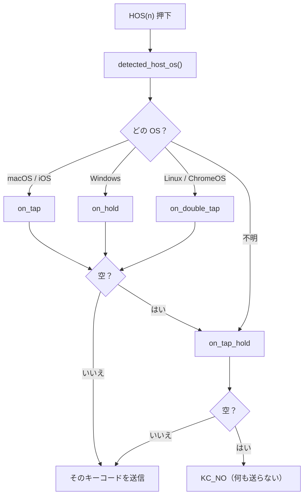
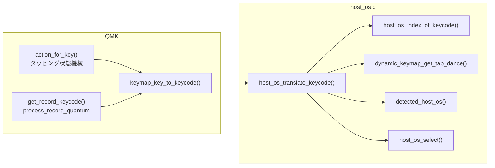
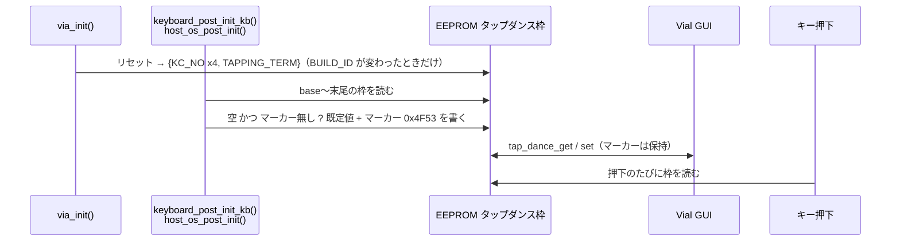

# HostOS — ファームウェア設計書

vial-qmk / このツリー内の Vial 対応キーボード全機種で共通の機能
英語版 `host-os-design.md` の日本語訳（2026-09-10 時点の内容と同期）。

関連ドキュメント

| ファイル | 対象読者 |
|---|---|
| `host-os-guide.md` / `.ja.md` | キーボード作者 — HostOS の導入方法 |
| `host-os-protocol.md` / `.ja.md` | Vial-GUI 開発者 — GUI が行うべきこと |
| `host-os-changes.md` / `.ja.md` | 全員 — どのファイルをなぜ変えたか |

経緯: 以前の版は専用の EEPROM 領域、Vial の新しいサブコマンド、新しいキーコード範囲
（`0x7E20`）を使っていた。その方式は Vial 本体のファイルを変更する必要があり、upstream への
提出計画とともに取りやめた（2026-09-08）。現在の設計は **Vial 本体のソースを一切触らず**、
最初の試作とまったく同じようにタップダンス枠を再利用する。名前だけが新しい。

---

## 1. 目的

接続先の OS に応じて送信キーコードが変わるキーを、次の条件で提供する。

- **Vial 本体を変更しない** — コアのソースもビルドファイルも、プロトコルも EEPROM レイアウトも変えない
- **素の vial-qmk にそのまま載る**: `host_os/` ディレクトリをコピーし、`vial.json` に
  `"hostOS": {"count": N}` を足し、keymap の `rules.mk` に `include .../host_os.mk` を 1 行足し、
  `keymap.c` で `#include "host_os.h"` する。件数を定義する場所は 1 箇所（`vial.json`）だけ
- Vial GUI から設定できる（対応版 GUI は専用タブを出す。標準 GUI でもタップダンスタブから編集できる）

## 2. 仕組みを一文で

**Vial のタップダンス枠の末尾 `HOST_OS_COUNT` 件を HostOS の設定として読み替え**、
キーコード解決の入口でファームウェアがキーコードを差し替える。

```
VIAL_TAP_DANCE_ENTRIES = 32, HOST_OS_COUNT = 16

枠  0 .. 15   通常のタップダンス          TD(0) .. TD(15)
枠 16 .. 31   HostOS 0 .. 15              HOS(0) .. HOS(15)  ==  TD(16) .. TD(31)
```

`HOST_OS_COUNT` は `host_os.mk` が `vial.json` から読む。
`HOST_OS_BASE = VIAL_TAP_DANCE_ENTRIES - HOST_OS_COUNT`、`HOS(n) = TD(HOST_OS_BASE + n)`。

## 3. 欄の対応

Vial のタップダンス 1 件は `{on_tap, on_hold, on_double_tap, on_tap_hold, custom_tapping_term}`。
HostOS の枠では次の意味になる。

| タップダンスの欄 | HostOS での意味 |
|---|---|
| `on_tap` | macOS（iOS / iPadOS も） |
| `on_hold` | Windows |
| `on_double_tap` | Linux（ChromeOS は Linux として判別される） |
| `on_tap_hold` | Default — OS 不明、または該当欄が空のとき |
| `custom_tapping_term` | 「初期化済み」マーカー `0x4F53`（§6 参照）。タッピングタームではない |

`KC_NO` と `KC_TRNS` はどちらも空扱い。選択の流れ:



iOS 専用の欄は無い。`os_variant_t` は iOS を区別できるが、「iOS は macOS と同じ」が
ユーザーの望む挙動であり、欄も 4 つしかないため。

## 4. 差し替えの場所

`keymap_key_to_keycode()`（`quantum/keymap_common.c:204`、weak）を `host_os.c` で
オーバーライドする。元の本体を複製し、その結果に `host_os_translate_keycode()` を適用する。



なぜここか: タッピング状態機械と `process_record` の両方がこの関数を通るため、HostOS の欄に
置いたモッドタップやレイヤータップは、キーマップに直接書いたのと**完全に同じ**挙動・遅延ゼロで
処理される。`process_record_user()` で横取りする方式は最初に試して却下した。
`action_tapping_process()` に再入し、モディファイアが目に見えて鈍くなるため。
`VIAL_MATRIX_MAGIC` の分岐（Vial がタップダンス／マクロの欄用に注入するキーコード）も
変換を通す必要がある。そうしないと、別のタップダンスの中に入れた `HOS(n)` が解決されない。

HostOS の欄に別の `HOS(m)` を入れることもできる。変換は最大 `HOST_OS_COUNT` 回繰り返し、
循環参照なら `KC_NO` を返す。

## 5. HostOS の枠がタップダンスとして動かない理由

差し替えは `process_tap_dance()` がキーコードを見る前に起きるので、その枠のタップ／ホールド／
ダブルタップの機構は一切動かない。したがって `custom_tapping_term` をマーカーとして自由に使える。

## 6. `keymap.c` の既定値と初期化済みマーカー

```c
#include "host_os.h"

const host_os_entry_t host_os_actions[HOST_OS_COUNT] = {
    [0] = HOST_OS(.kc_macos = KC_LGUI, .kc_windows = KC_LCTL),
};
```

Vial では設定の実体が EEPROM にあり、`dynamic_keymap_reset()` が全タップダンス枠を
`{KC_NO ×4, TAPPING_TERM}` で埋める。リセット経路は 2 つある。

| 経路 | きっかけ | `dynamic_keymap_reset()` 後に使えるフック |
|---|---|---|
| eeconfig 全体のリセット | 初回起動、`eeconfig_init` | `eeconfig_init_kb()` |
| VIA のみのリセット | **`BUILD_ID` の変化 ＝ 書き込みのたび** | なし（`via_init()` → `eeconfig_init_via()`） |

よく通る方の経路にリセット用フックが無いため、初期化は**起動のたびに** `keyboard_post_init_kb()`
（`keyboard_init()` の最後、`via_init()` の後に呼ばれる）から実行し、何度実行しても同じ結果に
なるようにしてある。`host_os_post_init()` は、枠 `HOST_OS_BASE + i` が完全に空で**かつ**
`custom_tapping_term` がマーカー `0x4F53` でないときだけ `host_os_actions[i]` を書き込み、
マーカーを立てる。ユーザーが編集した枠（何かキーコードが入っている、またはマーカーあり）には
絶対に触らない。



`keyboard_post_init_kb()` を自前で定義しているキーボードは `HOST_OS_NO_POST_INIT_HOOK` を定義し、
自前のフックから `host_os_post_init()` を呼ぶ。

## 7. GUI への伝え方

Vial GUI は枠の件数を**キーボード定義 JSON**（`vial.json`）から知る。これは Vial が元々
ファームウェアに埋め込み、GUI へ渡しているもの。キーボード作者が `vial.json` に
`"hostOS": {"count": N}` を書き、`host_os.mk` がビルド時に同じファイルを読んで `HOST_OS_COUNT` を
決めるので、**件数は 1 箇所にしか存在せず**、GUI とファームウェアが食い違うことはない。
キーが無い、または 0 ならビルドエラー。通信プロトコルは何も変わらない。詳細は `host-os-protocol.md`。

## 8. ビルドへの組み込み

**Vial のビルドファイルは一切変更しない。** `host_os/host_os.mk` を keymap 側の `rules.mk`
（`vial.json` と同じ場所のもの）から include する。

```make
include quantum/host_os/host_os.mk
```

この `.mk` は自分の場所と呼び出し元を `MAKEFILE_LIST` から求めるので、`host_os/` ディレクトリは
ツリー内のどこに置いてもよい。呼び出し元の `vial.json` から `hostOS.count` を読み、
`OS_DETECTION_ENABLE = yes` を設定し（keymap の `rules.mk` は `generic_features.mk` より先に
読まれるので、これで確実に `os_detection.c` が入る）、`VPATH`/`SRC` でソース 2 つを追加し、
`VIAL_HOST_OS_ENABLE` と `HOST_OS_COUNT` を定義する。

## 9. ファイル

| ファイル | 役割 |
|---|---|
| `quantum/host_os/host_os_select.h` / `.c` | 純粋ロジック: 構造体、フォールバック付きの選択、「末尾 N 枠」の計算。QMK 非依存 |
| `quantum/host_os/host_os.h` | `HOST_OS_BASE`、`HOS(n)`、`HOST_OS(...)`、`host_os_actions[]`、宣言 |
| `quantum/host_os/host_os.c` | static assert、変換、初期化、`keyboard_post_init_kb()` と `keymap_key_to_keycode()` のオーバーライド |
| `quantum/host_os/tests/` | ホスト側テスト 54 件、`run_tests.sh` |
| `quantum/host_os/host_os.mk` | ドロップイン用のビルド設定: `vial.json` から件数を読み、ソース・定義・`OS_DETECTION_ENABLE` を設定 |

## 10. ビルド時の検査

| アサート | 意味 |
|---|---|
| `HOST_OS_*` enum == `os_variant_t` | 純粋ロジックと QMK で OS の番号が一致 |
| `HOST_OS_KC_NO/TRNS` == `KC_NO/KC_TRNS` | 「空」の定義 |
| `HOST_OS_QK_TAP_DANCE(_MAX)` == `QK_TAP_DANCE(_MAX)` | タップダンスのキーコード範囲 |
| `HOST_OS_COUNT > 0` | 0 は設定ミス（`host_os.mk` でも先に弾く） |
| `HOST_OS_COUNT <= VIAL_TAP_DANCE_ENTRIES` | 存在する枠数を超えて確保できない |
| `VIAL_ENABLE` と `TAP_DANCE_ENABLE` が無ければ `#error` | HostOS は Vial のタップダンス枠に住む |

## 11. 制約

| # | 内容 |
|---|---|
| 1 | `HOST_OS_COUNT` 件の枠は通常のタップダンスとして使えなくなる |
| 2 | 標準の Vial GUI では HostOS の枠がタップダンスタブに Tap/Hold/… の欄名で出る。編集はできるが、そこで「tapping term」を変えると初期化済みマーカーが消える（枠を空にもしない限り無害） |
| 3 | USB 接続直後の数十 ms は OS が未確定で Default が使われる |
| 4 | ChromeOS は Linux として判別される |
| 5 | `HOS(n)` にタップダンスの意味付けは無い。欲しければ欄にモッドタップのキーコードを入れる |
| 6 | 2 つの関数（`keymap_key_to_keycode`、`keyboard_post_init_kb`）をオーバーライドする。どちらかを自前で定義しているキーボードは統合が必要（ガイド参照） |
