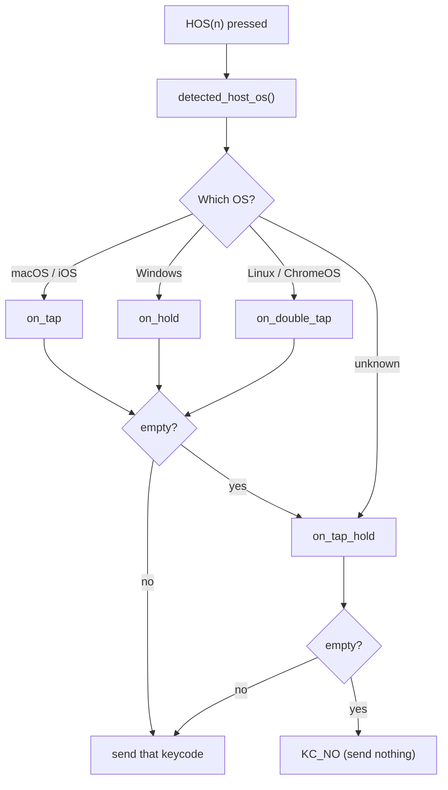
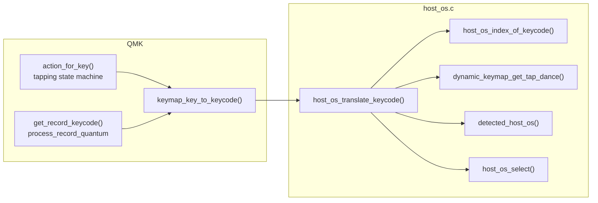
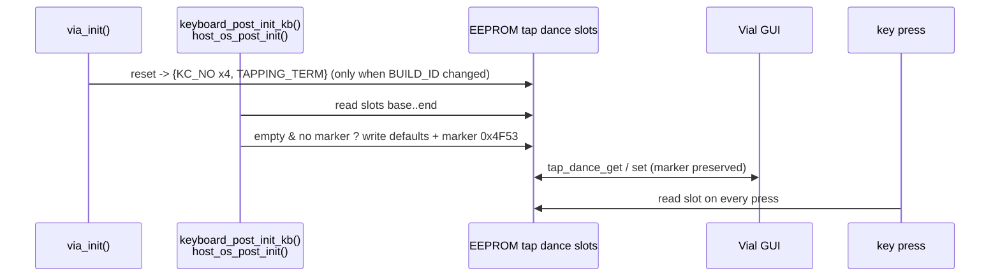

# HostOS — Firmware Design

vial-qmk / shared feature for every Vial-enabled keyboard in this tree

Related documents

| File | Audience |
|---|---|
| `host-os-guide.md` | Keyboard authors — how to add HostOS to a keyboard |
| `host-os-protocol.md` | Vial-GUI developers — what the GUI has to do |
| `host-os-changes.md` | Everyone — which files changed and why |

History: an earlier revision used a dedicated EEPROM region, new Vial sub-commands and a new
keycode range (`0x7E20`). That approach required changes to Vial core files and was abandoned
together with the plan to upstream it (2026-09-08). The current design touches **no Vial core
source**; it reuses tap dance slots exactly like the very first prototype, under the new name.

---

## 1. Goal

Provide a key that sends a different keycode depending on the host operating system, with:

- **zero changes to Vial itself** — no core source, no build file, no protocol or EEPROM layout change;
- **drop-in on stock vial-qmk**: copy the `host_os/` directory, add `"hostOS": {"count": N}` to
  `vial.json`, add one `include .../host_os.mk` line to the keymap's `rules.mk`, and
  `#include "host_os.h"` in `keymap.c`. The count is defined in exactly one place (`vial.json`);
- configuration from the Vial GUI (a HostOS-aware GUI shows a dedicated tab; a stock GUI can
  still edit the entries through its Tap Dance tab).

## 2. Mechanism in one sentence

**The last `HOST_OS_COUNT` Vial tap dance slots are reinterpreted as HostOS entries**, and the
firmware substitutes their keycode at the entry point of keycode resolution.

```
VIAL_TAP_DANCE_ENTRIES = 32, HOST_OS_COUNT = 16

slot  0 .. 15   ordinary tap dance          TD(0) .. TD(15)
slot 16 .. 31   HostOS 0 .. 15              HOS(0) .. HOS(15)  ==  TD(16) .. TD(31)
```

`HOST_OS_COUNT` is read from `vial.json` by `host_os.mk`;
`HOST_OS_BASE = VIAL_TAP_DANCE_ENTRIES - HOST_OS_COUNT`, `HOS(n) = TD(HOST_OS_BASE + n)`.

## 3. Field mapping

A Vial tap dance entry is `{on_tap, on_hold, on_double_tap, on_tap_hold, custom_tapping_term}`.
For a HostOS slot:

| Tap dance field | HostOS meaning |
|---|---|
| `on_tap` | macOS (and iOS / iPadOS) |
| `on_hold` | Windows |
| `on_double_tap` | Linux (ChromeOS is detected as Linux) |
| `on_tap_hold` | Default — unknown OS, or the matching field is empty |
| `custom_tapping_term` | "seeded" marker `0x4F53`, see §6. Not a tapping term |

`KC_NO` and `KC_TRNS` both count as empty. Selection:



iOS has no field of its own: `os_variant_t` distinguishes it, but "iOS behaves like macOS" is
what users want and there are only four fields.

## 4. Where the substitution happens

`keymap_key_to_keycode()` (`quantum/keymap_common.c:204`, weak) is overridden in `host_os.c`.
The body of the original is duplicated and `host_os_translate_keycode()` is applied to its
result.



Why there: both the tapping state machine and `process_record` go through this function, so a
mod-tap or layer-tap placed in a HostOS field behaves **exactly** as if written in the keymap,
with no added latency. Intercepting in `process_record_user()` was tried first and rejected: it
re-enters `action_tapping_process()` and makes modifiers noticeably sluggish. The
`VIAL_MATRIX_MAGIC` branch (keycodes injected by Vial for tap dance / macro fields) must go
through the translation too, otherwise `HOS(n)` nested in another tap dance would not resolve.

A HostOS field may hold another `HOS(m)`; translation repeats up to `HOST_OS_COUNT` times and
returns `KC_NO` on a reference cycle.

## 5. Why HostOS slots never behave as tap dances

The substitution happens before `process_tap_dance()` ever sees the keycode, so the slot's
tap/hold/double-tap machinery is never engaged. `custom_tapping_term` is therefore free to be
used as a marker.

## 6. Defaults in `keymap.c` and the seeded marker

```c
#include "host_os.h"

const host_os_entry_t host_os_actions[HOST_OS_COUNT] = {
    [0] = HOST_OS(.kc_macos = KC_LGUI, .kc_windows = KC_LCTL),
};
```

Vial keeps the live configuration in EEPROM, and `dynamic_keymap_reset()` fills every tap dance
slot with `{KC_NO ×4, TAPPING_TERM}`. Two reset paths exist:

| Path | Trigger | Hook available after `dynamic_keymap_reset()` |
|---|---|---|
| full eeconfig reset | first boot, `eeconfig_init` | `eeconfig_init_kb()` |
| VIA-only reset | **`BUILD_ID` changed = every flash** | none (`via_init()` → `eeconfig_init_via()`) |

Because the common path has no reset hook, seeding runs at **every boot** from
`keyboard_post_init_kb()` (called last in `keyboard_init()`, after `via_init()`), and must be
idempotent. `host_os_post_init()` writes `host_os_actions[i]` into slot `HOST_OS_BASE + i` only
when the slot is completely empty **and** its `custom_tapping_term` is not the marker
`0x4F53`; it then sets the marker. Slots the user has edited (any keycode set, or marker
present) are never touched.



Keyboards that define `keyboard_post_init_kb()` themselves define `HOST_OS_NO_POST_INIT_HOOK`
and call `host_os_post_init()` from their own hook.

## 7. Telling the GUI

The Vial GUI learns the slot count from the **keyboard definition JSON** (`vial.json`), which
Vial already embeds in the firmware and serves to the GUI. The keyboard author adds
`"hostOS": {"count": N}` to `vial.json`; `host_os.mk` reads the same file at build time to
set `HOST_OS_COUNT`, so **the count exists in exactly one place** and GUI and firmware cannot
disagree. A missing or zero count is a build error. Nothing in
the wire protocol changes. Details: `host-os-protocol.md`.

## 8. Build integration

**No Vial build file is modified.** `host_os/host_os.mk` is included from the keymap-level
`rules.mk` (the one next to `vial.json`):

```make
include quantum/host_os/host_os.mk
```

The `.mk` locates itself and its includer through `MAKEFILE_LIST`, so the `host_os/` directory
can live anywhere in the tree. It reads `hostOS.count` from the includer's `vial.json`, sets
`OS_DETECTION_ENABLE = yes` (the keymap `rules.mk` is read before `generic_features.mk`, so
this reliably pulls in `os_detection.c`), adds the two sources via `VPATH`/`SRC`, and defines
`VIAL_HOST_OS_ENABLE` and `HOST_OS_COUNT`.

## 9. Files

| File | Role |
|---|---|
| `quantum/host_os/host_os_select.h` / `.c` | Pure logic: entry struct, selection with fallback, "last N slots" arithmetic. No QMK dependency |
| `quantum/host_os/host_os.h` | `HOST_OS_BASE`, `HOS(n)`, `HOST_OS(...)`, `host_os_actions[]`, declarations |
| `quantum/host_os/host_os.c` | Static asserts, translation, seeding, `keyboard_post_init_kb()` and `keymap_key_to_keycode()` overrides |
| `quantum/host_os/tests/` | 54 host-side checks, `run_tests.sh` |
| `quantum/host_os/host_os.mk` | Drop-in build integration: reads the count from `vial.json`, sets sources, defines and `OS_DETECTION_ENABLE` |

## 10. Build-time checks

| Assert | Meaning |
|---|---|
| `HOST_OS_*` enum == `os_variant_t` | pure logic and QMK agree on OS numbering |
| `HOST_OS_KC_NO/TRNS` == `KC_NO/KC_TRNS` | "empty" definition |
| `HOST_OS_QK_TAP_DANCE(_MAX)` == `QK_TAP_DANCE(_MAX)` | tap dance keycode range |
| `HOST_OS_COUNT > 0` | a count of 0 is a configuration error (also rejected earlier by `host_os.mk`) |
| `HOST_OS_COUNT <= VIAL_TAP_DANCE_ENTRIES` | cannot reserve more slots than exist |
| `#error` unless `VIAL_ENABLE` and `TAP_DANCE_ENABLE` | HostOS lives in Vial tap dance slots |

## 11. Constraints

| # | Note |
|---|---|
| 1 | `HOST_OS_COUNT` slots are no longer available as ordinary tap dances |
| 2 | A stock Vial GUI shows the HostOS slots in its Tap Dance tab with Tap/Hold/… labels; editing works, but changing the "tapping term" there removes the seeded marker (harmless unless the slot is also emptied) |
| 3 | For the first tens of milliseconds after USB enumeration the OS is unknown and Default is used |
| 4 | ChromeOS is detected as Linux |
| 5 | `HOS(n)` has no tap-dance semantics; put a mod-tap keycode in a field if you want one |
| 6 | Two functions are overridden (`keymap_key_to_keycode`, `keyboard_post_init_kb`); a keyboard defining either must integrate (see guide) |
