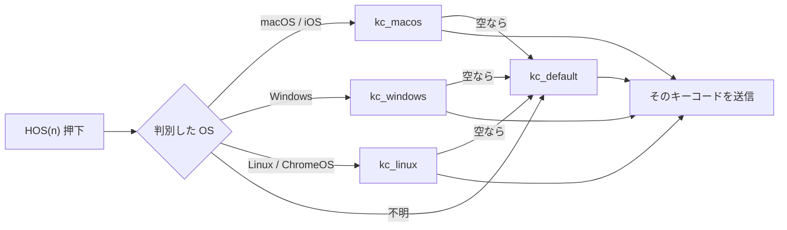

# HostOS 導入ガイド（キーボード作者向け）

英語版 `host-os-guide.md` の日本語訳（2026-09-10 時点の内容と同期）。
設計の背景は `host-os-design.md`、GUI 側は `host-os-protocol.md` を参照。

---

## HostOS とは

接続先の OS（macOS / Windows / Linux。iOS は macOS 扱い）を自動判別し、
**1 つのキーから OS ごとに違うキーコードを送る**機能。
たとえば「macOS では `Cmd`、Windows では `Ctrl`」を 1 キーで実現できる。

仕組みは、**Vial のタップダンス枠の末尾 N 件を確保し**、その 4 欄を
macOS / Windows / Linux / Default として読み替えるだけ。Vial のプロトコルや EEPROM
レイアウトには一切手を入れない。

---

## 前提条件

| 条件 | 確認方法 |
|---|---|
| Vial 対応ファームウェアである | `keymaps/<name>/rules.mk` に `VIAL_ENABLE = yes` がある |
| タップダンスが有効（Vial の既定） | `TAP_DANCE_ENABLE` を `no` にしていない |
| `host_os/` ディレクトリがツリー内にある | 置き場所は自由。このツリーでは `quantum/host_os/`。素の vial-qmk ならディレクトリをコピーするだけ |
| タップダンス枠が足りる | `HOST_OS_COUNT` ≤ `VIAL_TAP_DANCE_ENTRIES`（EEPROM 4 KB の機種で 32。超えるとビルドが止まる） |

OS 判別（`OS_DETECTION_ENABLE`）は自動で有効になる。

---

## 手順

### 1. `vial.json` に件数を書く

`keymaps/<name>/vial.json` に:

```json
{
  "hostOS": {"count": 16},
  ...
}
```

この 1 つの値を、Vial GUI（キーボード定義から読む）とファームウェアのビルド
（同じファイルから読む）の両方が使う。**件数を書く場所はここだけ。**
タップダンス 32 枠で 16 なら、`TD(0)`〜`TD(15)` が通常のタップダンス、
16〜31 が `HOS(0)`〜`HOS(15)` になる。

### 1b. keymap の `rules.mk` から `host_os.mk` を include する

`keymaps/<name>/rules.mk`（`VIAL_ENABLE = yes` がある、`vial.json` と同じ場所のファイル）に:

```make
include quantum/host_os/host_os.mk     # リポジトリのルートからのパス
```

### 2. `keymap.c` でライブラリを読み込む

```c
#include QMK_KEYBOARD_H
#include "host_os.h"
```

### 3. 任意: `keymap.c` に既定値を書く

```c
const host_os_entry_t host_os_actions[HOST_OS_COUNT] = {
    [0] = HOST_OS(.kc_macos = KC_LGUI, .kc_windows = KC_LCTL),
    [1] = HOST_OS(.kc_macos = KC_LNG2, .kc_windows = KC_INT5, .kc_linux = LCTL(KC_SPC)),
};
```

| 欄 | OS |
|---|---|
| `.kc_macos` | macOS と iOS |
| `.kc_windows` | Windows |
| `.kc_linux` | Linux（ChromeOS もここ） |
| `.kc_default` | 判別できないとき、および該当欄が空のときのフォールバック |

省略した欄は空になる。既定値は **その枠が完全に空のとき**（EEPROM リセット直後）にだけ
書き込まれ、Vial GUI で設定した内容が上書きされることはない。この手順を飛ばせば
全枠が空で始まり、GUI から設定する運用になる。

### 4. キーマップに `HOS(n)` を置く

```c
[_BASE] = LAYOUT(
    ...,
    HOS(0),    // <- HostOS の 0 番（32 枠 / 16 件なら TD(16)）
    ...
),
```

Vial GUI では、対応版なら `HOS(0)`、標準版なら `TD(16)` として表示される。

### 5. ビルドして書き込む

```bash
make <keyboard>:<keymap>
```

書き込みで EEPROM がリセットされるので、`.vil` を読み込み直す。HostOS の設定は
`.vil` のタップダンス部分に含まれるため、特別な扱いは不要。

---

## キー押下時の動き



`KC_NO` と `KC_TRNS` は「空」として扱う。すべて空なら何も送らない。

---

## 件数の決め方

| 枠数 | `hostOS.count` | 残る通常のタップダンス |
|---:|---:|---:|
| 32 | 16（既定） | 16 |
| 32 | 8 | 24 |
| 32 | 32 | 0 |
| 16 | 4 | 12 |

0（またはキー欠落）は `host_os.mk` が拒否し、枠数超過は static assert が拒否する。

---

## 既存コードとの相性

### `process_detected_host_os_user()` でレイヤーを切り替えている

HostOS と共存できるが、たいてい不要になる。外せば OS ごとに複製したレイヤーが空く。

### `keymap_key_to_keycode()` を自前で定義している

HostOS も同名の関数を定義するのでリンクに失敗する。自前の処理を `host_os.c` の版に統合するか、
HostOS を使わない。

### `keyboard_post_init_kb()` を自前で定義している

`config.h` に

```c
#define HOST_OS_NO_POST_INIT_HOOK
```

を足し、自前の `keyboard_post_init_kb()` から `host_os_post_init();` を呼ぶ。

### タップダンスの末尾枠を既に使っている

その枠は HostOS になる。タップダンスを若い番号へ移すか、`vial.json` の `hostOS.count` を減らす。

---

## ビルドエラーが出たら

| メッセージ | 原因 | 対処 |
|---|---|---|
| `HOST_OS_COUNT exceeds VIAL_TAP_DANCE_ENTRIES` | HostOS の件数がタップダンス枠数より多い | `vial.json` の `hostOS.count` を減らす |
| `HostOS: .../vial.json must contain "hostOS": {"count": N} with N >= 1` | キーが無い、読めない、または 0 | `vial.json` に `"hostOS": {"count": N}` を足す |
| `HostOS requires VIAL_ENABLE and TAP_DANCE_ENABLE` | Vial ビルドでない、またはタップダンス無効 | 有効にする |
| `multiple definition of 'keymap_key_to_keycode'` / `'keyboard_post_init_kb'` | 同名関数を自前で定義している | 上記「既存コードとの相性」参照 |
| `host_os.h: No such file or directory` | `include .../host_os.mk` の行が無い、またはパスが違う | keymap の `rules.mk` を確認 |

---

## 制約

| # | 内容 |
|---|---|
| 1 | 確保した枠は通常のタップダンスとしては使えない |
| 2 | USB 接続直後の数十 ms は OS が未確定で Default が使われる |
| 3 | ChromeOS は Linux として判別される。ChromeOS 用のキーコードは Linux 欄に入れる |
| 4 | `HOS(n)` 自体に連打・長押しの区別はない。必要なら欄に `LGUI_T(KC_TAB)` のようなモッドタップを入れる |
| 5 | `HOS(n)` はタップダンスの各欄・キーオーバーライド・マクロの中にも置ける |
| 6 | 標準の Vial GUI ではタップダンスタブに Tap / Hold / Double Tap / Tap+Hold の欄名で表示される（意味は macOS / Windows / Linux / Default）。対応版 GUI では HostOS タブになる |

---

## 最小の例

```make
# keyboards/<kb>/keymaps/vial/rules.mk
VIAL_ENABLE = yes
include quantum/host_os/host_os.mk
```

```json
// keyboards/<kb>/keymaps/vial/vial.json（抜粋）
{ "hostOS": {"count": 16}, ... }
```

```c
// keyboards/<kb>/keymaps/vial/keymap.c
#include QMK_KEYBOARD_H
#include "host_os.h"

const host_os_entry_t host_os_actions[HOST_OS_COUNT] = {
    [0] = HOST_OS(.kc_macos = KC_LGUI, .kc_windows = KC_LCTL),
};

const uint16_t PROGMEM keymaps[][MATRIX_ROWS][MATRIX_COLS] = {
    [0] = LAYOUT( HOS(0), KC_A, KC_B, ... ),
};
```

これで `HOS(0)` が macOS では `Cmd`、Windows では `Ctrl` になる。
