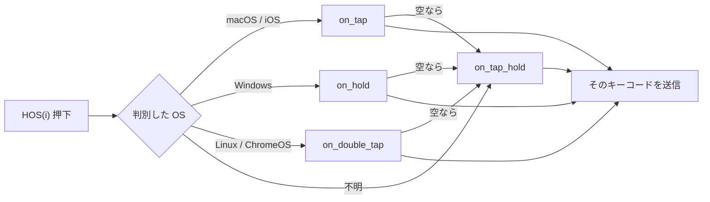
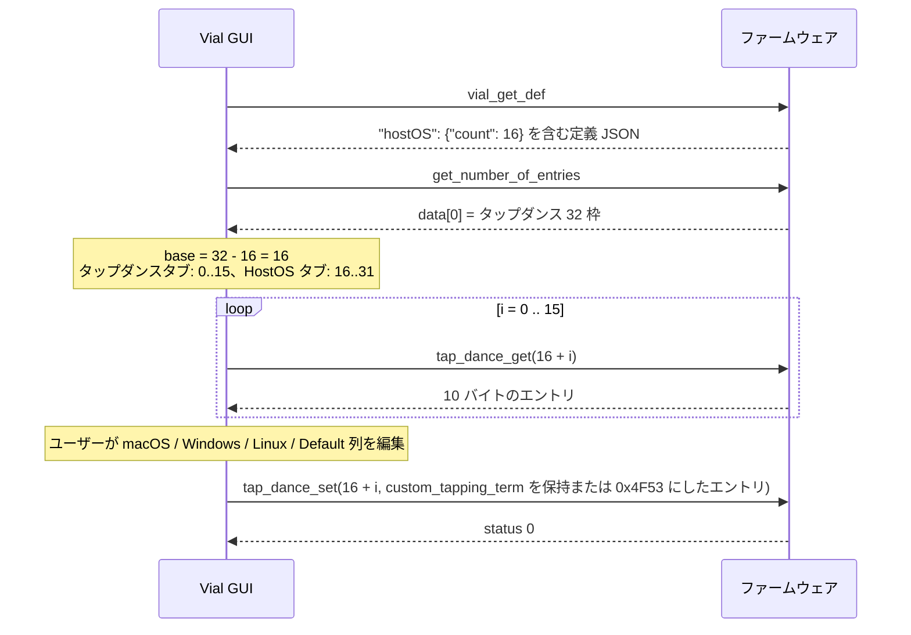

# HostOS — Vial-GUI 連携仕様

対象読者: vial-gui 開発者
ファームウェア設計: `quantum/host_os/docs/host-os-design.md`
英語版 `host-os-protocol.md` の日本語訳（2026-09-10 時点の内容と同期）。

---

## 1. GUI から見た HostOS

HostOS キーは、ファームウェアが判別した接続先 OS に応じて異なるキーコードを送る。
**設定は通常の Vial タップダンス枠に保存されている**: キーボードのタップダンス枠の末尾 `count` 件を
HostOS の設定として読み替える。その結果:

- **新しいプロトコルコマンドは無い。** 読み書きはすべて既存のタップダンス用サブコマンド
  （`dynamic_vial_tap_dance_get` = `0x01`、`dynamic_vial_tap_dance_set` = `0x02`）で行う
- **EEPROM レイアウトもプロトコルバージョンも変わらない。** `VIAL_PROTOCOL_VERSION` は `6` のまま
- **`.vil` ファイルも変わらない**: HostOS の設定は既存の `tap_dance` 配列の中に保存される

GUI の仕事は表示だけ。確保された枠をタップダンスタブから隠し、OS 名の列を持つ HostOS タブに出す。

## 2. 対応の判定

ファームウェアは **キーボード定義 JSON**（`vial.json`、GUI が `vial_get_def` で既に取得している
もの）で HostOS を宣言する。キーボード作者がこのキーを手で書き、ファームウェアのビルドも同じ
ファイルから件数を読むので、この値は信頼できる:

```json
{
  "...": "...",
  "hostOS": { "count": 16 }
}
```

| 条件 | GUI の動作 |
|---|---|
| `hostOS` キーがあり `count > 0` | HostOS タブを表示し、タップダンス枠の末尾 `count` 件を確保する |
| `hostOS` キーが無い | 普通の Vial キーボード。HostOS タブは出さず、タップダンスタブも従来どおり |

ファームウェアのビルドは `1 ≤ count ≤ tap_dance_count` を保証する（それ以外はビルドを拒否する）。
GUI 側でも念のためクランプすること。

## 3. 枠の計算

```
tap_dance_count = dynamic_vial_get_number_of_entries の data[0]   （GUI が既に読んでいる）
count           = definition["hostOS"]["count"]
base            = tap_dance_count - count

タップダンスタブ : 枠 0 .. base-1
HostOS タブ      : 枠 base .. tap_dance_count-1 を HostOS 0 .. count-1 として表示
HostOS i         <->  タップダンス枠 (base + i)
```

例: タップダンス 32 枠、`count` = 16 → タップダンスタブは 0〜15、HostOS タブは枠 16〜31 を
HostOS 0〜15 として表示。

## 4. 欄の対応

タップダンス 1 件は既存の 10 バイト構造
`(on_tap, on_hold, on_double_tap, on_tap_hold, custom_tapping_term)`、各 `uint16_t`、
リトルエンディアン。HostOS の枠では各欄の意味は次のとおり。

| タップダンスの欄 | HostOS での意味 | 列ラベル案 |
|---|---|---|
| `on_tap` | **macOS** 用キーコード（iOS / iPadOS にも使う） | macOS |
| `on_hold` | **Windows** 用キーコード | Windows |
| `on_double_tap` | **Linux** 用キーコード（ChromeOS は Linux として判別される） | Linux |
| `on_tap_hold` | **Default**: OS 不明のとき、または該当欄が空のときに使う | Default |
| `custom_tapping_term` | **初期化済みマーカー**（§6 参照）。タッピングタームではない。表示せず、読んだ値をそのまま書き戻す | — |

空欄: ファームウェアは `0x0000`（KC_NO）と `0x0001`（KC_TRNS）の両方を「未設定」として扱う。
**ユーザーが欄を消したときは `0x0000` を書くこと。**

キー押下のたびにファームウェアが行うフォールバック:



Default も空なら何も送らない。

## 5. 読み書き

既存のタップダンスコマンドを、枠番号 `base + i` で使う:

```
読み:  [0xFE, 0x0D, 0x01, base+i]              -> msg[0]=status, msg[1..10]=エントリ
書き:  [0xFE, 0x0D, 0x02, base+i, エントリ(10B)] -> msg[0]=status
```

ファームウェアは 4 つのキーコード欄に、通常のタップダンスとまったく同じ `vial_keycode_firewall()`
をかける（ロック中に `QK_BOOT` を書くと `0` になる）。再読み込みすべきキャッシュは無い。
HostOS キーは押下のたびに EEPROM から枠を読むので、書き込みは即座に反映される。

## 6. `custom_tapping_term` の初期化済みマーカー

HostOS は `custom_tapping_term` をタッピングタームとしては使わない。ファームウェアはこれを
マーカーに使う:

- EEPROM リセット後、全タップダンス枠は `{KC_NO, KC_NO, KC_NO, KC_NO, TAPPING_TERM}` になる
- 起動時、4 つのキーコードがすべて `KC_NO` で**かつ** `custom_tapping_term` が `0x4F53`（`"OS"`）
  でない HostOS 枠に対して、ファームウェアはキーボードのコンパイル時既定値
  （`keymap.c` の `host_os_actions[]`、無ければ全 `KC_NO`）を書き込み、
  `custom_tapping_term = 0x4F53` にする
- 空でないキーコードが 1 つでもある枠、または既にマーカーが付いている枠には触らない

**GUI の規則:** エントリを読み、4 つのキーコード欄だけを編集し、**`custom_tapping_term` は読んだ
値のまま書き戻す**。ユーザーが HostOS エントリを保存するときに `0x4F53` にしてもよい。そうすると、
ユーザーが意図的に 4 欄を全部消しても再初期化されないことが保証される。

## 7. キーコードの表示

キーマップ上の HostOS キーは文字どおり `TD(base + i)` である。GUI は:

- キーコードを表示するすべての場所（キーマップ、タップダンスの欄、キーオーバーライド、マクロ）で
  `TD(base + i)` を **`HOS(i)`** として表示する
- キーコードピッカーの HostOS グループに `HOS(0)` … `HOS(count-1)` を用意し、タップダンスグループ
  からは `TD(base)` … `TD(tap_dance_count-1)` を**出さない**
- `.vil` やユーザー入力を解釈するときは両方の表記（`HOS(i)` と `TD(base+i)`）を受け付け、数値の
  `TD` キーコードとして保存する。ファームウェアは `HOS(n)` を `TD(HOST_OS_BASE + n)` と定義して
  いるので、通信上は同一である

`HOS(i)` は別のタップダンスの欄、キーオーバーライド、マクロの中に入れてもよい。ファームウェアは
キーコード解決の入口で解決するので、ピッカーでは普通のキーと同じ扱いでよい。

## 8. タップダンスタブ

枠 `0 .. base-1` だけを表示する。タブ数は再接続のたびに（`rebuild_ui`）計算し直し、その前に既存の
タブを削除すること。削除しないと再接続のたびにタブが増える。

## 9. `.vil` ファイル

形式の変更なし。`tap_dance` は `tap_dance_count` 要素のままで、HostOS のエントリはその末尾 `count`
件、5 番目の要素にマーカーが入る。素の Vial で保存した `.vil` を HostOS ファームウェアに読み込んでも
そのまま動く（末尾の枠が HostOS として解釈されるだけ）。`count` が異なるキーボードで保存した `.vil`
を読み込むと境界がずれる。GUI は警告してもよいが、拒否する必要はない。

## 10. シーケンス



## 11. GUI が実装すべきことのまとめ

| 項目 | 場所 |
|---|---|
| 定義 JSON から `hostOS.count` を読む | `keyboard_comm.py`（`payload.get("hostOS")`） |
| `base = tap_dance_count - count` | `reload_dynamic()` の後 |
| タップダンスタブを `base` 件に制限し、再構築時に古いタブを消す | `editor/tap_dance.py` |
| HostOS タブ: `count` 件、列は macOS / Windows / Linux / Default、マーカーは素通し | `editor/host_os.py` |
| `HOS(i)` ↔ `TD(base+i)` の表示と解釈、ピッカーのグループ | `keycodes.py` |
