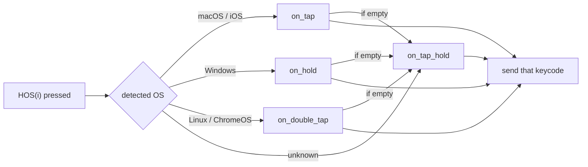
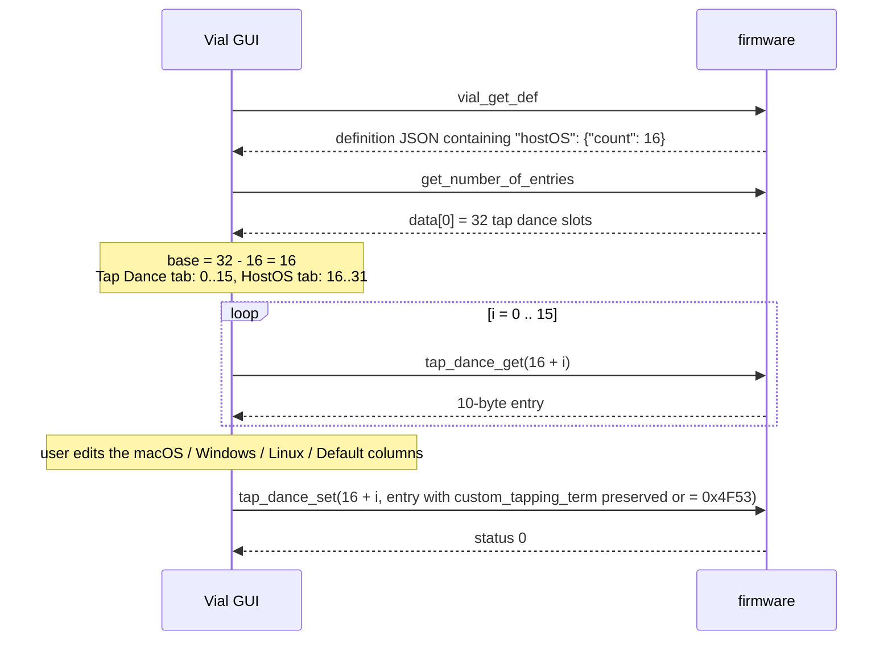

# HostOS — Vial-GUI Integration Specification

Audience: vial-gui developers
Firmware design: `quantum/host_os/docs/host-os-design.md`

---

## 1. What HostOS is, from the GUI's point of view

HostOS keys send a different keycode depending on the host operating system detected by the
firmware. **They are stored in ordinary Vial tap dance slots**: the last `count` tap dance
entries of a keyboard are reinterpreted as HostOS entries. Consequently:

- **No new protocol commands.** Everything is read and written with the existing tap dance
  sub-commands (`dynamic_vial_tap_dance_get` = `0x01`, `dynamic_vial_tap_dance_set` = `0x02`).
- **No EEPROM layout change, no protocol version change.** `VIAL_PROTOCOL_VERSION` stays `6`.
- **`.vil` files are unchanged**: HostOS entries are saved inside the existing `tap_dance` array.

The GUI's job is purely presentational: hide the reserved slots from the Tap Dance tab and show
them in a HostOS tab with OS-named columns.

## 2. Capability detection

The firmware advertises HostOS through the **keyboard definition JSON** (`vial.json`, the same
JSON the GUI already fetches with `vial_get_def`). The keyboard author adds the key by hand,
and the firmware build reads its count from the very same file, so the value is authoritative:

```json
{
  "...": "...",
  "hostOS": { "count": 16 }
}
```

| Condition | GUI behaviour |
|---|---|
| `hostOS` key present and `count > 0` | Show the HostOS tab; reserve the last `count` tap dance slots |
| `hostOS` key absent | Plain Vial keyboard; no HostOS tab, Tap Dance tab unchanged |

The firmware build guarantees `1 ≤ count ≤ tap_dance_count` (it refuses to build otherwise).
The GUI should still clamp defensively.

## 3. Slot arithmetic

```
tap_dance_count = data[0] of dynamic_vial_get_number_of_entries   (already read by the GUI)
count           = definition["hostOS"]["count"]
base            = tap_dance_count - count

Tap Dance tab : slots 0 .. base-1
HostOS tab    : slots base .. tap_dance_count-1, shown as HostOS 0 .. count-1
HostOS i      <->  tap dance slot (base + i)
```

Example: 32 tap dance slots, `count` = 16 → Tap Dance tab shows 0–15, HostOS tab shows
HostOS 0–15 backed by slots 16–31.

## 4. Field mapping

A tap dance entry is the existing 10-byte structure
`(on_tap, on_hold, on_double_tap, on_tap_hold, custom_tapping_term)`, each `uint16_t`,
little-endian. For a HostOS slot the fields mean:

| Tap dance field | HostOS meaning | Suggested column label |
|---|---|---|
| `on_tap` | keycode for **macOS** (also used for iOS / iPadOS) | macOS |
| `on_hold` | keycode for **Windows** | Windows |
| `on_double_tap` | keycode for **Linux** (ChromeOS is detected as Linux) | Linux |
| `on_tap_hold` | **Default**: used when the OS is unknown, or when the matching field is empty | Default |
| `custom_tapping_term` | **Seeded marker** (see §6). Not a tapping term. Do not show; write back unchanged | — |

Empty fields: the firmware treats both `0x0000` (KC_NO) and `0x0001` (KC_TRNS) as "not set".
**When the user clears a field, write `0x0000`.**

Fallback performed by the firmware on every key press:



If Default is empty as well, nothing is sent.

## 5. Read / write

Use the existing tap dance commands with the slot number `base + i`:

```
read:   [0xFE, 0x0D, 0x01, base+i]              -> msg[0]=status, msg[1..10]=entry
write:  [0xFE, 0x0D, 0x02, base+i, entry(10B)]  -> msg[0]=status
```

The firmware runs `vial_keycode_firewall()` on the four keycode fields exactly as it does for
ordinary tap dances (writing `QK_BOOT` while locked yields `0`). There is no cache to reload:
HostOS keys read the slot from EEPROM on every press, so a write takes effect immediately.

## 6. The seeded marker in `custom_tapping_term`

`custom_tapping_term` is unused by HostOS as a tapping term. The firmware uses it as a marker:

- After an EEPROM reset every tap dance slot is `{KC_NO, KC_NO, KC_NO, KC_NO, TAPPING_TERM}`.
- At boot, for each HostOS slot whose four keycodes are all `KC_NO` **and** whose
  `custom_tapping_term` is not `0x4F53` (`"OS"`), the firmware writes the keyboard's compile-time
  default (from `host_os_actions[]` in `keymap.c`, all `KC_NO` if none) and sets
  `custom_tapping_term = 0x4F53`.
- A slot that has any non-empty keycode, or already carries the marker, is never touched.

**GUI rule:** read the entry, edit only the four keycode fields, and **write
`custom_tapping_term` back exactly as read**. Optionally set it to `0x4F53` when the user
saves a HostOS entry — that guarantees the slot is never re-seeded even if the user clears all
four fields on purpose.

## 7. Keycode display

A HostOS key in the keymap is literally `TD(base + i)`. The GUI should:

- display `TD(base + i)` as **`HOS(i)`** wherever keycodes are shown (keymap, tap dance
  fields, key overrides, macros);
- offer `HOS(0)` … `HOS(count-1)` in the keycode picker under a HostOS group, and **not**
  offer `TD(base)` … `TD(tap_dance_count-1)` in the Tap Dance group;
- when parsing a `.vil` or user input, accept both spellings (`HOS(i)` and `TD(base+i)`)
  and store the numeric `TD` keycode. The firmware defines `HOS(n)` as `TD(HOST_OS_BASE + n)`,
  so the two are identical on the wire.

`HOS(i)` may be nested inside another tap dance's fields, a key override or a macro; the
firmware resolves it at the entry point of keycode resolution, so the picker may treat it
like any ordinary key.

## 8. Tap Dance tab

Show only slots `0 .. base-1`. The tab count must be recomputed on every reconnect
(`rebuild_ui`), and existing tabs removed first, otherwise reconnecting appends tabs.

## 9. `.vil` files

No format change. `tap_dance` keeps `tap_dance_count` elements; HostOS entries are the last
`count` of them, with the marker in the fifth element. Loading a `.vil` saved by a plain Vial
onto a HostOS firmware works as is (the last slots are simply interpreted as HostOS).
Loading a `.vil` saved on a keyboard with a different `count` shifts the boundary; the GUI may
warn but need not block.

## 10. Sequence



## 11. Summary of what the GUI must implement

| Item | Where |
|---|---|
| Read `hostOS.count` from the definition JSON | `keyboard_comm.py` (`payload.get("hostOS")`) |
| `base = tap_dance_count - count` | after `reload_dynamic()` |
| Limit the Tap Dance tab to `base` entries, clearing old tabs on rebuild | `editor/tap_dance.py` |
| HostOS tab: `count` entries, columns macOS / Windows / Linux / Default, marker passthrough | `editor/host_os.py` |
| `HOS(i)` ↔ `TD(base+i)` display and parsing; picker group | `keycodes.py` |
